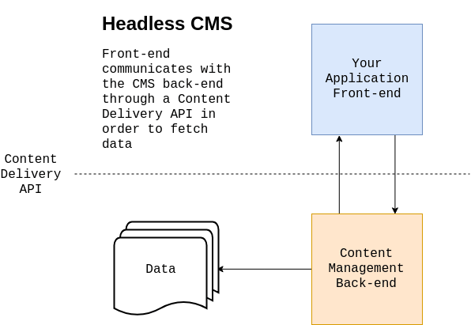
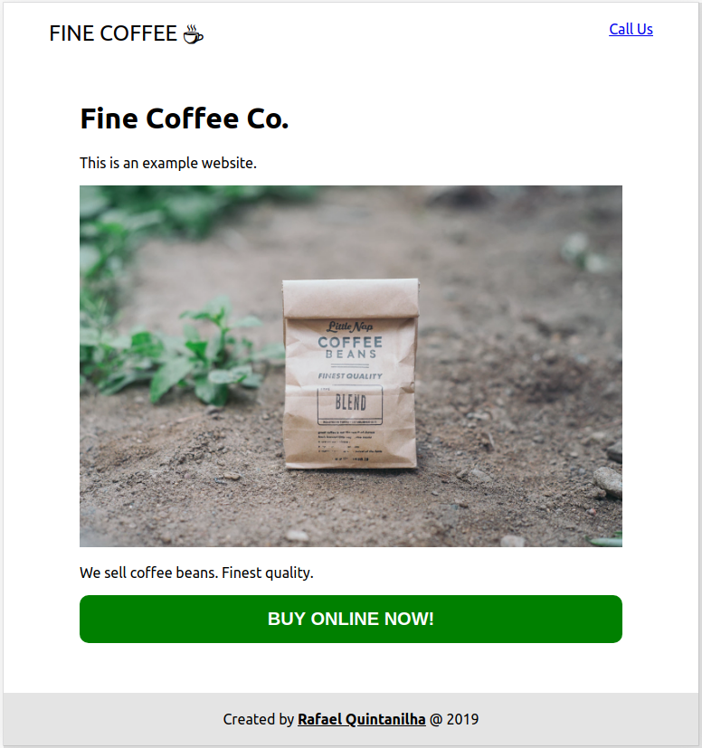
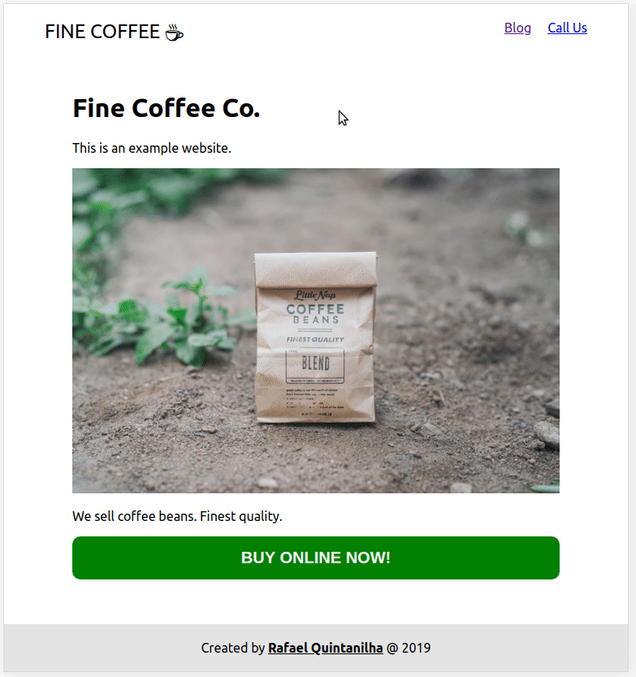
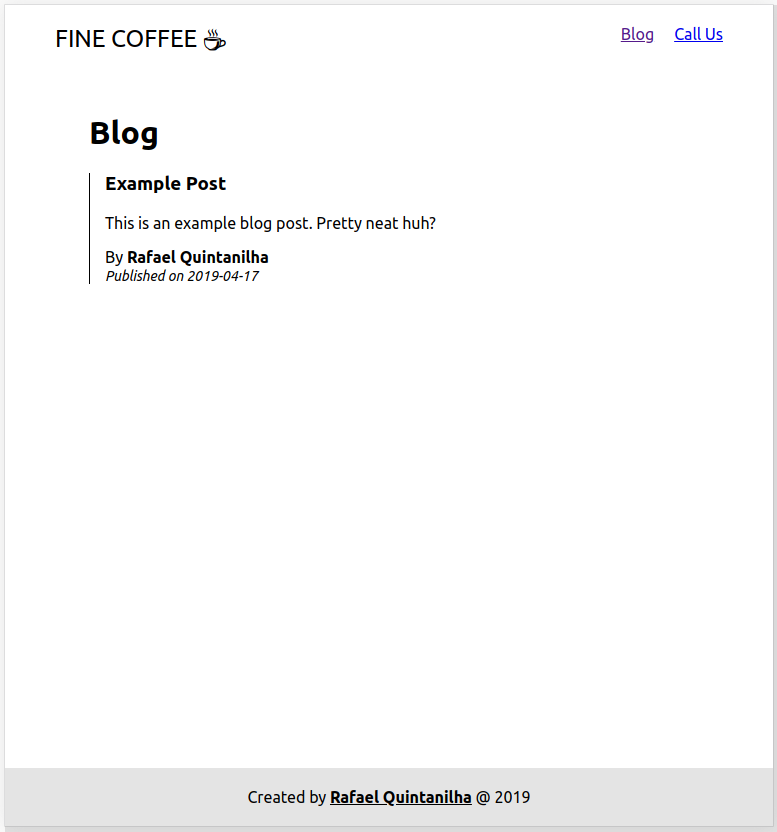
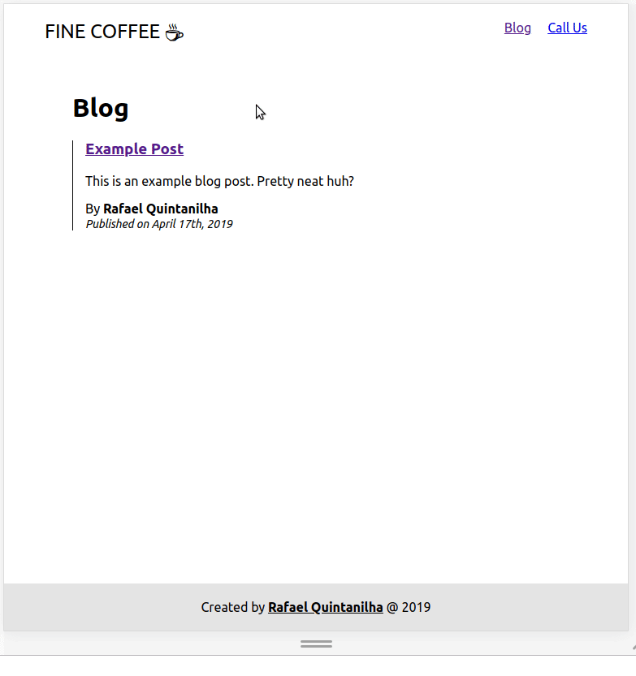
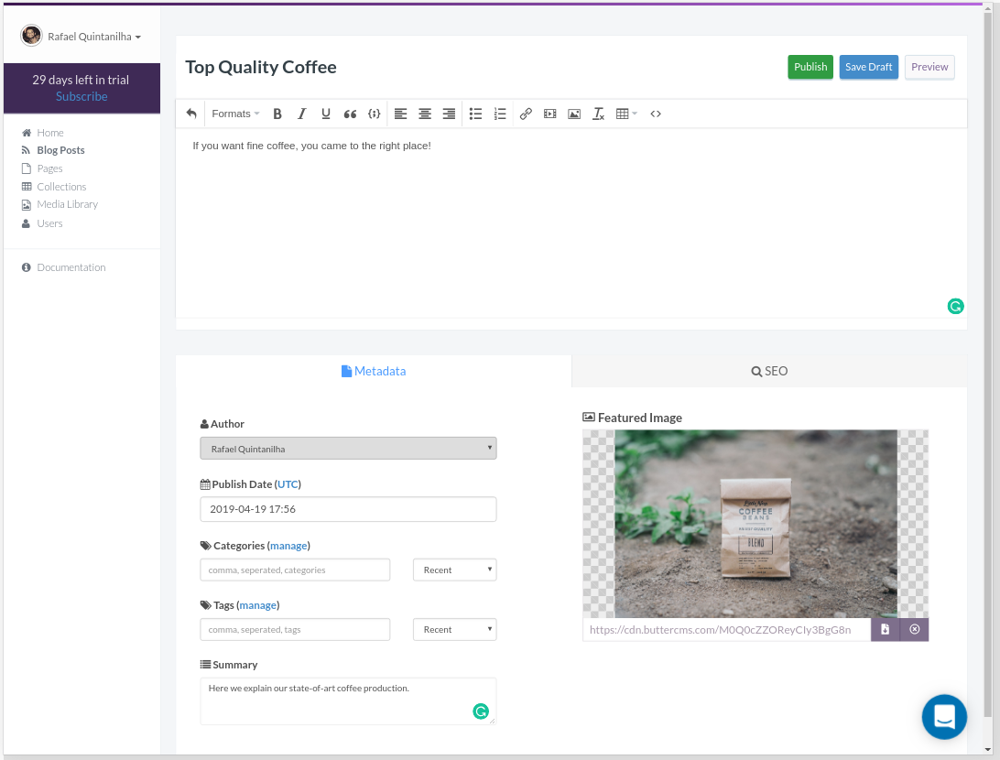
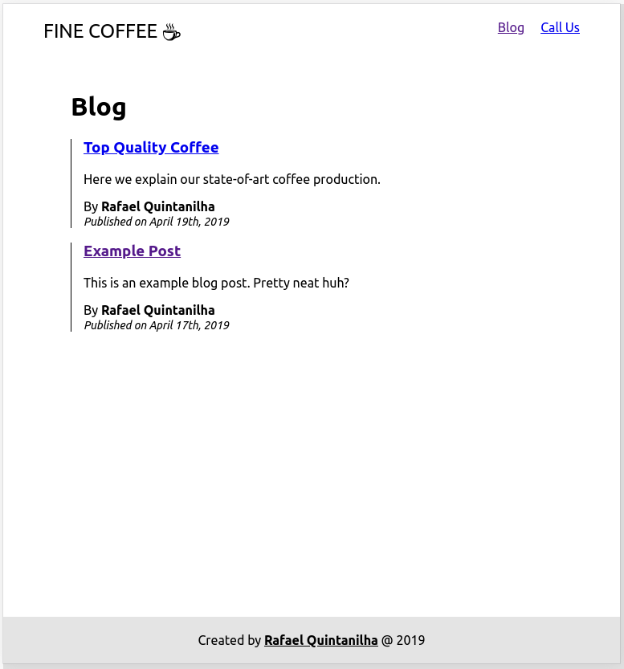

[This article was originally posted in the ButterCMS blog.](https://buttercms.com/blog/cms-integration-how-to-add-a-blog-into-existing-site)

Consider the following scenario: you have a fully-functional website, and you want to add a blog to it. The problem: you haven’t previously accounted for this, and you start wondering what the best solution may be that won’t require a major rewrite of your working app.

Perhaps your website is instead still under development, but all solutions for adding blogging functionality seem difficult to fit in your current stack.

Sound familiar?

You may be a good candidate for CMS (Content Management System) integration for your app or website. CMS integration is simply taking your existing website/web app and integrating a Content Management System with it _without_ having to resort to a complex monolithic solution like WordPress. It is the degree of freedom you are looking for in order to keep your tech stack of choice and still be able to enjoy the best of what a Content Management System can offer.

In other words, **CMS integration is how to add CMS capabilities into an existing website**. This article aims to explain more of it in practice, what the pain points are, how to solve them, and how you can efficiently add a CMS into your current project without needing to rewrite everything from scratch.

## Challenges of CMS Integration

Traditional CMS solutions, like WordPress, have historically evolved into whole solutions controlling everything for your app or website. It means that your app will most likely live as a “monolith”, a single unit of technology that is supposed to control the entirety of your website.

This might be fine until it isn’t anymore. Suppose you grow tired of WordPress and want to change the CMS provider. Afterall, you are likely to encounter scalability issues with a monolithic solution as it grows. You now have a problem, as you will need to rebuild core parts of your app that might not even be related to the CMS. Or maybe you are an experienced developer who likes to write web apps using your preferred tech stack, but require an easy interface for non-technical content creators and editors to be able to add and edit content without needing you to update code.

Historically, CMS solutions are tightly coupled to the app. You can minimize the impact of an eventual change in the future by early planning, but the reality is that you won’t always be able to foresee the need for it - and even if you do, current approaches are just suboptimal, as we will see next.

### The Subdomain Approach

A way to circumvent the constraints imposed by a monolith solution is to move your blog to a different subdomain, such as **blog**.example.com. By doing this you can set up your CMS and still keep your favorite tech stack. For example, you might have a website built with Angular + NodeJS and install a WordPress blog in another subdomain.

While this works there are some caveats with this approach:

1. **SEO**. The main issue is that setting up your blog under a subdomain [can negatively impact your SEO](https://buttercms.com/blog/blog-subdomain-or-subdirectory-hint-one-is-40-better). For content that depends on organic searches, this is very undesirable.
2. **UI consistency**. You will be tasked with the extra work of maintaining a consistent UI for two separate apps, so you don’t confuse your users. As naive as it is, consider the case where you have developed a layout for your web app and now need to find (or develop) a WordPress theme that resembles it.
3. **Multiple apps overhead**. instead of one, you will have two applications to maintain. In the long run, this may cause a lot of headaches.

### The Subdirectory Approach

An alternative to subdomains is to use subdirectories. In fact, subdirectories mitigate the major issues presented by subdomains. First, [they are SEO friendly](https://buttercms.com/blog/blog-subdomain-or-subdirectory-hint-one-is-40-better). Also, they are still part of the same app, just installed in a different directory. This structure softens the multi-app and multi-UI overhead.

The problem is that setting a CMS in a subdirectory can be technically challenging. It is definitely non-trivial to orchestrate everything together. A DevOps problem is something you certainly don’t want to foster.

### What Then?

Both approaches have in common a considerable integration effort. Moreover, you don’t fully decouple your app from the CMS, meaning that they coexist in a clunky way. A truly good solution should neutralize integration risks and have minimal impact on the current architecture, especially from a DevOps perspective. This is something a headless CMS enables you to do.

## A Conceptual Overview of CMS Integration

A headless CMS is a back-end content repository that makes content accessible via API. This approach allows you to treat content as you would treat any regular piece of data.

### Content as Data

Suppose that you want to integrate your app with Google Maps. You do not want to make any styling changes, you should not set up any other servers, and you should keep everything in the same domain without creating a new directory. How is this possible?

This happens because you assume whatever geolocalization data you might need will be fetched in a predictable way from a 3rd-party application. Hence all you need to do is to prepare to receive that piece of information and display it accordingly. For instance, putting a marker in a map given a set of coordinates.

Traditional CMS solutions already perform these operations, but only for internal consumption. WordPress will save your content in the database and retrieve it when necessary, without exposing it to other applications. The way your layout or themes consume this data is different from what a regular API does, because you need to use framework-specific methods. These methods add one more layer of complexity, no matter how thorough you find their documentation.

This is precisely how a solution like Butter can help. ButterCMS, a headless CMS, allows you to create content normally in a separate environment, as it should be, and consume content directly in your app through an API. The end result is your content being managed as regular data, fetched from Butter’s servers and rendered as you wish, without changing the architecture of your app.



Using content as data means that you need to be language agnostic, i.e. you should be able to grab your content regardless of your tech stack. [Butter currently supports all major languages](https://buttercms.com/api-first-cms/), so you can throw it at your app today and start blogging at once.

In the next section, we will see how it works in practice by adding a blog into a regular website.

## CMS Integration in Practice

Now that we understand what CMS integration means, let us see how one can do it. For the sake of this tutorial, I will be using React but as I mentioned earlier, you can work with your favorite stack. Go ahead and [check all available APIs in the ButterCMS website](https://buttercms.com/blog-engine/) if you haven’t done that before.

In our example, let us assume that we have an existing website and our goal is to add a blog into it. Here’s how it looks like before we add any Butter.

<figure>
  
  <figcaption>Simple website with no blog content.</figcaption>
</figure>

There is nothing fancy on the site right now. It’s just a regular website with some dummy content. You can follow along this tutorial by [checking this GitHub repo](https://github.com/rafaelquintanilha/butter-example/tree/without-butter). This project was bootstrapped with [Create React App](https://facebook.github.io/create-react-app/). For simplicity I’ll omit CSS changes but the main file can be inspected [here](https://github.com/rafaelquintanilha/butter-example/blob/master/src/App.css).

### Adding the Router

Let’s add a page that will hold our blog content and will work as a subdirectory. As explained before, this approach improves SEO. For this, we will need [React Router](https://reacttraining.com/react-router/web/guides/quick-start). In your app directory open the terminal and type:

```
yarn react-router-dom
```

Or alternatively:

```
npm i --save react-router-dom
```

To simplify the code, I’ll break our home down into three different components. Here is how _App.js_ looks like:

```jsx
import React, { Component } from 'react'
import './App.css'
import Home from './Home'
import Header from './Header'
import Footer from './Footer'

class App extends Component {
  render() {
    return (
      <div className="container">
        <Header />
        <Home />
        <Footer />
      </div>
    )
  }
}

export default App
```

Now, we want to be able to render either `Home` or the list of blog posts. We will then replace Home with the router and make sure that the main element is common to all routes:

```jsx
…
import {
  BrowserRouter as Router,
  Route,
  Switch
} from 'react-router-dom';

class App extends Component {
  render() {
    return (
      <div className="container">
        <Router>
          <Header />
          <main>
            <Switch>
              <Route exact path="/" component={Home} />
            </Switch>
          </main>
          <Footer />
        </Router>
      </div>
    );
  }
}
…
```

Save and check your progress by running `npm start` and going to [http://localhost:3000](http://localhost:3000). You will see that your app loads normally but if you change the URL to [http://localhost:3000/blog](http://localhost:3000/blog) an empty space will be rendered. Let’s fix that!

### Adding the Blog Page

Once the router is all set, let us create a dummy page which we will use to hold the blog content in just a moment. Go ahead and create a file called _Blog.js_, adding this code:

```jsx
import React from 'react'

const Blog = () => {
  return (
    <div>
      <h1>Blog</h1>
    </div>
  )
}

export default Blog
```

Now it’s time to make our router aware of this new page. In _App.js_:

```jsx
...
<main>
  <Switch>
    <Route exact path="/" component={Home} />
    <Route exact path="/blog" component={Blog} />
  </Switch>
</main>
...
```

We need a way to allow users to visit the blog page without needing to manually change the URL. Let’s fix that in _Header.js_:

```jsx
import React from 'react'
import { Link } from 'react-router-dom'

const Header = () => (
  <header>
    <nav>
      <div className="logo">
        <Link to="/">
          Fine Coffee{' '}
          <span role="img" aria-label="Coffee">
            ☕
          </span>
        </Link>
      </div>
      <ul className="menu">
        <li>
          <Link to="/blog">Blog</Link>
        </li>
        <li>
          <a href="tel:">Call Us</a>
        </li>
      </ul>
    </nav>
  </header>
)

export default Header
```

And that’s it! You now have a subdomain all set just waiting for your blog posts:

<figure>
  
</figure>

### Adding Butter

In order to use Butter to fetch your content, you will need an API key. Go to [Butter’s main page](https://buttercms.com/) and sign up for the trial in order to get one.

With the key in hand, create a file called _butter-client.js_ under the _src_ folder:

```jsx
import Butter from 'buttercms'

const butter = Butter('<YOUR_API_KEY>')

export default butter
```

Make sure to replace `<YOUR_API_KEY>` with your actual key.

The next step is to modify _Blog.js_ in order to connect with Butter. For some extra fun I will use the new React Hooks API.

```jsx
import React, { useState, useEffect } from 'react'
import butter from './butter-client'
import PostSnippet from './PostSnippet'

const Blog = () => {
  const [loading, setLoading] = useState(false)
  const [error, setError] = useState(false)
  const [data, setData] = useState(null)

  const fetchPosts = async () => {
    setLoading(true)
    setError(false)
    try {
      const response = await butter.post.list({
        page: 1,
        page_size: 10,
      })
      setData(response.data)
    } catch (e) {
      setError(`There was an error: ${e.message}`)
    }
    setLoading(false)
  }

  useEffect(() => {
    fetchPosts()
  }, [])

  const getPosts = () => (
    <div>
      {data.data.map((post, i) => (
        <PostSnippet {...post} key={i} />
      ))}
    </div>
  )

  const getContent = () => {
    if (loading) return <p>Fetching posts...</p>
    if (error) return <p>{error}</p>
    if (!data) return null
    return getPosts()
  }

  return (
    <div>
      <h1>Blog</h1>
      {getContent()}
    </div>
  )
}

export default Blog
```

The key part is the highlighted line. This is where we communicate with ButterCMS and retrieve our content. Notice that for simplicity we are fetching only the first ten posts. You can check the [API Reference](https://buttercms.com/docs/api/?javascript) if you are curious about other possibilities.

The rest of the code is about setting up control variables and rendering the correct content. Notice that we run `fetchPosts()` only when the component mounts, which is defined by the `useEffect` hook without any dependencies (an empty array).

Observe that for each returned post we render the `PostSnippet` component, where we display basic information about the post such as the title, the summary, and the author’s name. Let’s move forward and create _PostSnippet.js_:

```jsx
import React from 'react'
import moment from 'moment'

const PostSnippet = props => {
  return (
    <div className="post-snippet">
      <h3>{props.title}</h3>
      <p>{props.summary}</p>
      <div>
        <div>
          By{' '}
          <strong>
            {props.author.first_name} {props.author.last_name}
          </strong>
        </div>
        <span className="publication-date">
          Published on {moment(props.published).format('YYYY-MM-DD')}
        </span>
      </div>
    </div>
  )
}

export default PostSnippet
```

Refer to the documentation to inspect all values returned by the API. Note the use of [MomentJS](https://momentjs.com/) for formatting the date of publication.

Here is how your blog page should be looking now with the dummy post Butter automatically creates:

<figure>
  
  <figcaption>Blog page with fetched posts.</figcaption>
</figure>

The last step is to display the full post and have a permalink, i.e. a permanent URL, to it.

### Routing to the Post

Every post will have its own link. Let’s go back to _App.js_ and add a new route:

```jsx
...
<Switch>
  <Route exact path="/" component={Home} />
  <Route exact path="/blog" component={Blog} />
  <Route path="/blog/:slug" render={Post} />
</Switch>
...
```

This new route will be activated when the URL is in the format https://example.com/blog/my-fancy-post and render the `Post` component. In order to make this work, we need `Post` to have all the information needed to render the content. Let’s go back to `PostSnippet` and add a hyperlink to the title:

```jsx
const PostSnippet = props => {
  return (
    <div className="post-snippet">
      <h3>
        <Link to={{
          pathname: `/blog/${props.slug}`,
          state: props
        }}>
          {props.title}
        </Link>
      </h3>
      ...
```

Notice that we use the slug as the permalink and we pass the props contained in the snippet directly to whichever component is set to the route (in our case, `Post`). Very neat from the react-router folks!

Finally, it is time to create the `Post` component:

```jsx
import React from 'react'
import moment from 'moment'
import { Link } from 'react-router-dom'

const Post = props => {
  const data = props.location.state
  return (
    <div className="post">
      <h1>{data.title}</h1>
      <hr />
      <div className="author">
        
        <div>
          Published by{' '}
          <strong>
            {data.author.first_name} {data.author.last_name}
          </strong>{' '}
          on {moment(data.published).format('MMMM Do, YYYY')}
        </div>
      </div>
      <hr />
      <div dangerouslySetInnerHTML={{ __html: data.body }} />
      <hr />
      <Link to="/blog">&larr; Back to the posts list</Link>
    </div>
  )
}

export default Post
```

The data passed via the state prop of the `Link` component is accessible through `props.location.state`. This is all we need in order to display the correct content.

If everything went well, this is the final result:

<figure>
  
</figure>

### Adding Content

Once we successfully integrated the CMS into our existing website, we can easily manage the content on Butter’s side. Fortunately, there is no need to touch any code anymore - _and we have decoupled our app from the CMS!_

To illustrate how easy adding new content can be, let’s open Butter’s admin panel, click on _Blog Posts_ and create a new post by adding some content and hitting _Publish_:

<figure>
  
  <figcaption>ButterCMS new post interface.</figcaption>
</figure>

With the post published, go back to the app and check that it’s already there:

<figure>
  
  <figcaption>Blog page with new content.</figcaption>
</figure>

And that’s it! Our integration is complete with minimum effort.

The [full code for this tutorial is available on GitHub](https://github.com/rafaelquintanilha/butter-example). There is also a [live example](https://butter-example.netlify.com/) if you are curious about the end result.

## Conclusion

The web is continuously evolving resulting in obtrusive solutions that don’t play along with other technologies being pushed aside. Integration and maintainability are major concerns that need to be addressed with responsibility.

Treating your content as regular data gives you the flexibility you need to enjoy the power of CMS solutions without being chained to a piece of technology, as you never know when you may want to switch it in the future. Freedom of choice and less maintenance headaches are huge wins for developers.

To wrap it up, a good CMS integration should:

- **Decouple your website from the data**. Both should coexist without being directly connected, in the sense that changes in one end do not affect the other end.
- **Allow easy integration**. A plain and simple API will do the job. Just call the API when you want to insert content from the CMS into your app.
- **Have a reduced cost of change**. If you ever want to change the underlying technologies that power up your application, having a CMS should not impact the complexity of the change.
- **Give you freedom of tech stack**. The CMS should be agnostic to whichever tech stack you decided to use in your project. They are separate entities and therefore should not interfere with each other apart from the API.

## Further Reading

In this article, we demonstrated how you can integrate ButterCMS with a React application. There is also an extensive list of how to do the same with other platforms:

- [Use ButterCMS with Vue.js](https://buttercms.com/vuejs-cms/)
- [Use ButterCMS with Angular](https://buttercms.com/angular-cms/)
- [Use ButterCMS with Django](https://buttercms.com/django-cms/)
- [Use ButterCMS with Golang](https://buttercms.com/golang-cms/)
- [Use ButterCMS with PHP](https://buttercms.com/php-cms/)

[And many others!](https://buttercms.com/api-first-cms/)
