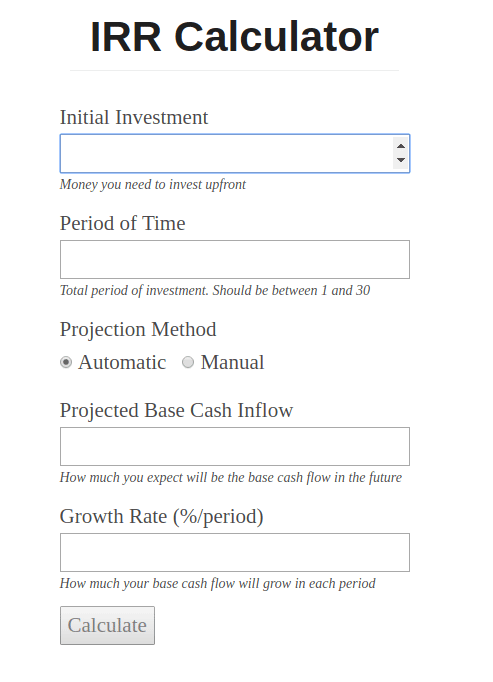

[In the last article](https://rafaelquintanilha.com/making-better-investments-with-math-and-javascript/) we covered the concepts of _NPV_ (Net Present Value) and _IRR_ (Internal Return Rate), with math insights and almost no code. Now we are going to get more serious and develop an online tool that will enable us to calculate the IRR for a given investment.

Curious already? [Check it out](/apps/irr-calculator).

## Recap

Recall that IRR is the discount rate $r$ that gives us $NPV = 0$. In simple words, for a given initial investment and a projected cash flow over time, IRR tells us what the return rate is. 

Our goal then is to _compare_ multiple investments and analyze their IRR's in order to make better financial choices. It applies for a wide range of endeavours -- from opening a new restaurant to buying AAPL stocks. The online calculator should be, then, simple to use and quick to test multiple assumptions. Let's assess our requirements. 

## Requirements

Here's a really condensed list of requirements for our app:

1. It must work online and in multiple devices (responsive);
2. The user must provide an initial amount, a period of time, and a cash flow;
3. The user may input the cash flow manually or;
4. The user may generate the cash flow automatically given a projected base cash flow and a growth rate;
5. It must be fully accessible through the keyboard;
6. The app must not accept invalid inputs.

As you can see, nothing fancy. For Requirement #4 we will need some extra math and for #5 we will need to deal with accessibility, DOM and refs.

## The App

All the code for this simulator can be found on [GitHub](https://github.com/rafaelquintanilha/blog/tree/master/src/pages/apps/irr-calculator).

Here's a simulation for one of the examples given in [Making Better Investments with Math and JavaScript](https://rafaelquintanilha.com/making-better-investments-with-math-and-javascript/) (Elon's proposal). Compare it with the above requirements.

<span style="display:block;text-align:center"></span>

Requirements #3 and #4 are covered and #6 is gracefully achieved (button remains disabled until all inputs are present). 

Let's start with the code (don't worry if you can't figure out what all lines are doing, we will revisit them soon):

```jsx
import React from 'react';
import css from './index.module.css';
import Helmet from 'react-helmet';
import { IRR } from './util';
import NumericInput from './NumericInput';
import ModeSelector from './ModeSelector';
import Result from './Result';

const MODE = { AUTO: "AUTO", MANUAL: "MANUAL" };

export default class Calculator extends React.Component {

  constructor() {
    super();
    this.state = {
      initialAmount: "",
      projectedCash: "",
      growthRate: "",
      period: "",
      IRR: "",
      manualProjectedFlow: [],
      projectionMethod: MODE.AUTO
    };
    this.investmentInput = React.createRef();
  }

  ...

  render() {
    return (
      <div className={css['container']}>
        <Helmet
          htmlAttributes={{lang: 'en'}}
          meta={[{name: 'description', content: "Simulate the IRR of your investment"}]}
          title={"IRR Calculator"}
        />
        <header>
          <h1>IRR Calculator</h1>
        </header>
        <main className={css['main']}>
          <NumericInput 
            autoFocus
            min={0}
            label="Initial Investment"
            hint="Money you need to invest upfront"
            value={this.state.initialAmount}
            onChange={this.onInputChange.bind(this, "initialAmount")}
            ref={this.investmentInput}
          />
          <NumericInput 
            min={1}
            label="Period of Time"
            hint="Total period of investment. Should be between 1 and 30"
            value={this.state.period}
            onChange={this.onPeriodChange.bind(this)}  
          />
          <ModeSelector
            autoValue={MODE.AUTO}
            manualValue={MODE.MANUAL}
            isAutoMode={this.isAutoMode}
            isManualMode={this.isManualMode}
            onChange={e => this.setState({projectionMethod: e.target.value})}
          />
          {this.automaticProjection}
          {this.manualProjection}
          <button 
            disabled={!this.isFormValid} 
            onClick={this.onClick.bind(this)}>Calculate</button>
          {this.IRR}
        </main>
        <footer className={css['footer']}>
          Created by 
          {' '}
          <a href="https://rafaelquintanilha.com">Rafael Quintanilha</a>
        </footer>
      </div>
    );
  }
}
```

The `constructor` should be easy to follow. Note that we define our state as a list of empty values, the exception being `manualProjectedFlow` and `projectionMode`. 

The first is an array which will hold the _projected cash flow_ for a given period $t$. So, in the above .gif, `manualProjectedFlow` is an array of length 1 in which `manualProjectedFlow[0] === 11000`. The latter determines in which mode we are: `AUTO` or `MANUAL` (defaults to `AUTO`).

We'll talk about `this.investmentInput = React.createRef();` in a bit. But first note that apart from the mode selection (`MANUAL` or `AUTO`) all inputs are numeric. It made sense then to come up with a `<NumericInput />` component that we will describe next:

```jsx
import React from 'react'
import css from './NumericInput.module.css';
import { uniqueId } from 'lodash';

export default class NumericInput extends React.Component {

  constructor() {
    super();
    this.id = uniqueId("irr-");
    this.input = React.createRef();
  }

  get hint() {
    if ( !this.props.hint ) return null;
    return <div className={css['hint']}>{this.props.hint}</div>;
  }

  focus() {
    this.input.current.focus();
  }

  render() {
    const { label, value, onChange, hint, ...rest } = this.props;
    return (
      <div>
        <label htmlFor={this.id}>{label}</label>
        <br />
        <input
          className={css['input']}
          ref={this.input}
          id={this.id}
          type="number" 
          value={value}
          onChange={onChange}
          {...rest}
        />
        {this.hint}
      </div>
    );
  }
}
```

Couple things going on here. 

First and foremost note that we use [destructure assignment](https://developer.mozilla.org/en-US/docs/Web/JavaScript/Reference/Operators/Destructuring_assignment) in order to flexbilize the accepted props for our input. We only fix some props, notably `type`, `value` and `onChange`.

Notice also that, in order to meet a11y standards, we generate an `id` by calling [lodash's uniqueId](https://lodash.com/docs/4.17.11#uniqueId). We then assign this `id` to both `input` and `label`, so screenreaders now can work properly.

Finally notice that we create a ref and assign it to our `input`. More than that, we create a class method `focus()` which basically focus on the `input`. Why is that? Recall one of the `NumericInput` components of `Calculator`:

```jsx
<NumericInput 
  autoFocus
  min={0}
  label="Initial Investment"
  hint="Money you need to invest upfront"
  value={this.state.initialAmount}
  onChange={this.onInputChange.bind(this, "initialAmount")}
  ref={this.investmentInput}
/>
```

The ref created in the constructor is assigned to this `NumericInput`, the first input and the one we want to programatically trigger focus. By doing that, when we call `this.investmentInput.current`, instead of accessing the DOM element (as you may expect from [refs documentation](https://reactjs.org/docs/refs-and-the-dom.html)), we get a _component instance_ and therefore we can call `focus()`. This technique is also explained [here](https://reactjs.org/docs/refs-and-the-dom.html#adding-a-ref-to-a-class-component). Notice that this is [somewhat discouraged by the React team](https://reactjs.org/docs/refs-and-the-dom.html#exposing-dom-refs-to-parent-components), which advocates _ref forwarding_ instead. While I do agree with them, I believe one can make a case for simply adding a ref to the child (for example when the child component *needs* to be a class component).

---

Back to the `render` function of `Calculator` you will also find `Helmet`, which basically adds a `<head>` tag to our document. [Check their documentation](https://github.com/nfl/react-helmet) if you want to know more.

```jsx
<Helmet
  htmlAttributes={{lang: 'en'}}
  meta={[{name: 'description', content: "Simulate the IRR of your investment"}]}
  title={"IRR Calculator"}
/>
```

Let's now dive into the projection modes.

## Auto Mode

Suppose that you want to calculate the IRR for an investment which is supposed to be 30 years long. You project that it is able to yield \$10,000/year and that it can grow 2.5% each year. In this case, the _projected base cash inflow_ is $10000$ and the _growth rate_ is $0.025$. 

In other words, you predict that in the first year the investment will generate $10000$ in cash. In the following year, $10000 * (1 + 0.025)$. In the end of the third year it will be $10000 * (1 + 0.025)^2$ and you get the idea. How do we translate this into code?

First we define a getter which only renders when on `AUTO` mode:

```jsx
get automaticProjection() {
  if ( this.isManualMode ) return null;
  return (
    <React.Fragment>
      <NumericInput 
        label="Projected Base Cash Inflow"
        value={this.state.projectedCash}
        onChange={this.onInputChange.bind(this, "projectedCash")}
        hint="How much you expect will be the base cash flow in the future"
      />
      <NumericInput 
        label="Growth Rate (%/period)"
        hint="Total period of investment. Should be between 1 and 30"
        value={this.state.growthRate}
        onChange={this.onInputChange.bind(this, "growthRate")} 
        hint="How much your base cash flow will grow in each period"
      />
    </React.Fragment>
  );
}
```

Which basically renders markup and assigns the correct `value` and `onChange` to each input. 

We then can evaluate the projected cash flow:

```jsx{2}
get projectedCashFlow() {
  return Array(this.state.period).fill(0)
    .map((el, i) => this.state.projectedCash * Math.pow((1 + this.state.growthRate / 100), i));
}
```

The only tricky part here is creating an array of projected cash flow in a functional fashion. Instead of using a `for` loop (which is fine), I resorted to use `Array(this.state.period).fill(0)`. This basically creates an array of length `this.state.period` and fill it with zeroes. The value is not particularly important, but `.fill` is what makes it iterable. [This post](https://medium.freecodecamp.org/https-medium-com-gladchinda-hacks-for-creating-javascript-arrays-a1b80cb372b) is very thorough in explaining how to manipulate and create arrays in various ways.

And now we can create a cash flow from three inputs: the period, the base projected cash flow and the growth rate.

## Manual Mode

If you want more control over your simulation, you may simply provide values for each period individually. Look at the correspondent getter:

```jsx
get manualProjection() {
  if ( !this.isValid(this.state.period) || this.isAutoMode ) return null;
  return (
    <React.Fragment>
      {Array(this.state.period).fill(0).map((el, i) => (
        <NumericInput
          key={i}
          label={`Cash Flow for Period ${i+1}`}
          value={this.isValid(this.state.manualProjectedFlow[i]) ? this.state.manualProjectedFlow[i] : ""}
          onChange={this.onManualCashChange.bind(this, i)}
        />
      ))}
    </React.Fragment>
  );
}
```

Because each period maps to a new entry in the cash flow, we necessarily need `this.state.period` to be a valid value. We define `isValid` as:

```jsx
isValid(value) {
  return value !== "" && !isNaN(value);
}
```

Again we resort to `Array(this.state.period).fill(0)` to generate an array of size `this.state.period`. When a particular cash flow entry change, we need to update `this.state.manualProjectedFlow` accordingly (remember we initialized it as an empty array). Here's how we do it:

```jsx
onManualCashChange(i, e) {
  const clone = this.state.manualProjectedFlow.concat([]);
  clone[i] = parseFloat(e.target.value);
  this.setState({manualProjectedFlow: clone});
}
```

Because in React we aim for immutability, we first clone the current array _before_ updating it. A simple way to do it is to simply concatenate the original array with an empty one.

## Calculating the IRR

The final step is to gather all information together and evaluate the IRR. This is done in the `onClick` handler of the rendered button, but it will be available only if the form is valid:

```jsx
get isFormValid() {
  if ( this.isAutoMode ) {
    return this.isValid(this.state.initialAmount)
      && this.isValid(this.state.period)
      && this.isValid(this.state.growthRate)
      && this.isValid(this.state.projectedCash);
  }
  else if ( this.isManualMode ) {
    return this.isValid(this.state.initialAmount)
      && this.isValid(this.state.period)
      && this.state.manualProjectedFlow.length === this.state.period
      && this.state.manualProjectedFlow.reduce((acc, val) => acc && this.isValid(val), true);
  }
}
```

For the `AUTO` mode we simply check that all base inputs are valid and for `MANUAL` mode also check that we have a valid entry for each period. When `this.isFormValid === true` we can proceed:

```jsx
onClick() {
  const futureCashflow = this.isAutoMode ? this.projectedCashFlow : this.state.manualProjectedFlow;
  const cashflow = [(-1) * this.state.initialAmount, ...futureCashflow];
  this.setState({IRR: IRR(cashflow)});
}
```

Notice that `futureCashflow` is defined as the projected flow for that investment, evaluated differently in `AUTO` or `MANUAL` modes. We then append this to the `initialAmount`, which has its sign inverted (we are assuming nobody is paying _you_ upfront, as unfortunate as this can be).

The complete `cashflow` array is then fed to the `IRR` function [we came up with in the previous post](/making-better-investments-with-math-and-javascript/#writing-a-function-to-evaluate-the-irr). For the sake of this tool, though, I used a slightly different version:

```jsx{15}
export const IRR = (cashflow, initialGuess = 0.1) => {
  const maxTries = 10000;
  const delta = 0.001;
  let guess = initialGuess;
  const multiplier = NPV(cashflow, guess) > 0 ? 1 : -1;
  let i = 0;
  while ( i < maxTries ) {
    const guessedNPV = NPV(cashflow, guess);
    if ( multiplier * guessedNPV > delta ) {
      guess += (multiplier * delta);
      i += 1;
    }
    else break;
  }
  return i === 10000 ? "IRR has diverged" : guess;
}
```

Notice that now we return either `guess` or a friendly message if we have exceed `maxTries`. The computed IRR is then passed to the `Result` component as follow:

```jsx
get IRR() {
  if ( !this.state.IRR ) return null;
  return <Result IRR={this.state.IRR} onResetClick={this.onResetClick.bind(this)} />;
}
```

`Result` in its turn is pretty straightforward:

```jsx
import React from 'react'

export default class Result extends React.Component {

  format(num) {
    return parseFloat(Math.round(num * 10000) / 100).toFixed(2) + "%";
  }

  render() {
    return (
      <React.Fragment>
        {isNaN(this.props.IRR)
          ? <div>{this.props.IRR}. Please try again.</div>
          : <div>Projected IRR is <strong>{this.format(this.props.IRR)}</strong></div>
        }
        <a href="#" onClick={this.props.onResetClick}>Reset</a>
      </React.Fragment>
    );
  }
}
```

Notice that when `this.props.IRR` is not a number (for example, when it has diverged) we display the divergence message. Else, we render a nicely formatted value with 2 decimal points.

Finally, we provide a link for easily resetting all information and to start again. It's defined on `Calculator`:

```jsx
onResetClick(e) {
  // highlight-next-line
  e.preventDefault();
  this.setState({
    initialAmount: "",
    projectedCash: "",
    growthRate: "",
    period: "",
    IRR: "",
    manualProjectedFlow: []
  });
  // highlight-next-line
  this.investmentInput.current.focus();
}
```

The first highlighted line is `e.preventDefault`, which is a simple tricky to avoid appending `#` to the end of the URL after clicking on the anchor tag. And finally the second highlighted line calls `focus()` as defined in `NumericInput` in order to programatically focus on the first input after reset.

## Wrapping Up

This was a quick overview of how to create an online tool that enables users to quickly simulate investments by calculating their IRR. Again, [check the full code in GitHub](https://github.com/rafaelquintanilha/blog/tree/master/src/pages/apps/irr-calculator) and play with the [live demo](/apps/irr-calculator).

Ideas of how to improve the simulation? PRs are welcome!