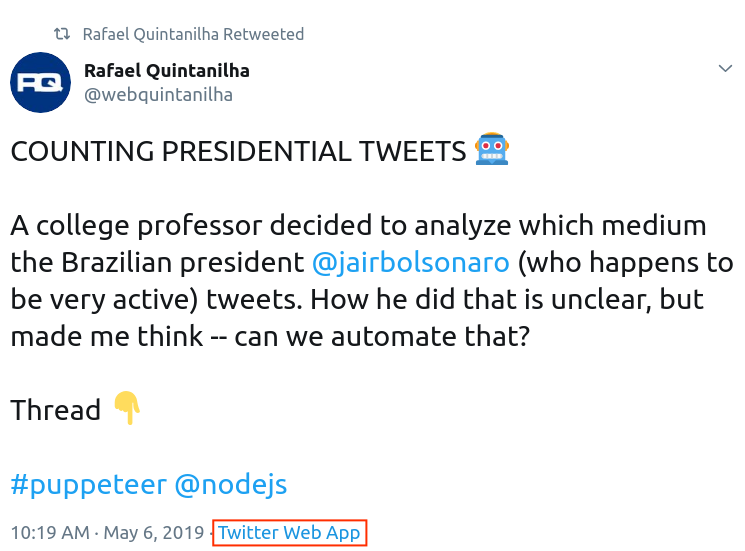

## Some Context

The Brazilian president Jair Bolsonaro is very active in the social media, specifically, [Twitter](https://twitter.com/jairbolsonaro). This behavior, which has been disrupting "traditional media", is controversial at least. It is also debatable if the president himself is the owner of the account or if [his son](https://twitter.com/carlosbolsonaro), who adopts a more aggressive style, has been tweeting.

This big dilemma (contains irony) caught the attention of a [college professor who allegedly counted 6.452 tweets](https://veja.abril.com.br/blog/radar/mais-de-90-dos-tweets-de-bolsonaro-vieram-de-celular-igual-o-de-carlos/), discovered that most of them were from an iPhone and Sherlock Holmes-style declared that Bolsonaro's son (who apparently owns an iPhone) must be the one piloting the account (it is said that the president owns a Samsumg, even though he has been seen with an Apple device several times).

This big puzzle (contains irony) sparkled me an idea -- can one count tweets in an efficient manner? It is unclear how the professor did it (most likely a poor undergrad was given this noble task), but I like to think that I am saving humans' time (computers serve for this purpose, after all).

In my Twitter account I gave a sneak peek of what we are going to see in this post:

<blockquote class="twitter-tweet"><p lang="en" dir="ltr">COUNTING PRESIDENTIAL TWEETS 🤖<br><br>A college professor decided to analyze which medium the Brazilian president <a href="https://twitter.com/jairbolsonaro?ref_src=twsrc%5Etfw">@jairbolsonaro</a> (who happens to be very active) tweets. How he did that is unclear, but made me think -- can we automate that? <br><br>Thread 👇<a href="https://twitter.com/hashtag/puppeteer?src=hash&amp;ref_src=twsrc%5Etfw">#puppeteer</a> <a href="https://twitter.com/nodejs?ref_src=twsrc%5Etfw">@nodejs</a></p>&mdash; Rafael Quintanilha (@webquintanilha) <a href="https://twitter.com/webquintanilha/status/1125404654647631873?ref_src=twsrc%5Etfw">May 6, 2019</a></blockquote> <script async src="https://platform.twitter.com/widgets.js" charset="utf-8"></script>

So now it is time to elaborate.

## Opening the Toolbox

In order to scrape the tweets, I used [puppeteer](https://github.com/GoogleChrome/puppeteer), which is an awesome headless solution powered by the Google Chrome folks. Puppeteer is awesome and has a large community, so finding how to login into Twitter is as easy as [this less-than-20-lines-code](https://github.com/checkly/puppeteer-examples/blob/master/3.%20login/twitter.js).

Puppeteer is a Node library, so make sure you have Node installed on your machine. Also notice that all code related to this tutorial is [available on GitHub](https://github.com/rafaelquintanilha/automation/blob/master/tweetCounter.js).

## The Plan

Before starting to get technical, let us establish a baseline plan for our end goal. We want to:

1. Navigate to the target account (in our case, [@jairbolsonaro](https://twitter.com)).
2. Open the most recent tweet.
3. Scrape the medium used to tweet (e.g. *Twitter for iPhone*, *Twitter for Android*, etc).
4. Go back and open the next tweet.
5. Repeat 3 and 4 until we analyze all tweets.

It is simple but has some gotchas. As we are going to see, Twitter does his best to prevent us to spam their server (and you can get rate-limited) and also try to efficiently load tweets, so only a handful tweets are "visible" at a single time (i.e. in order to prevent overloading your browser, if you keep scrolling down the top tweets are replaced).

Finished with the preamble, let's finally get our hands around some code.

## First Steps

Setup puppeteer is as easy as:

```js{4}
(async () => {
  const browser = await puppeteer.launch({ headless: false });
  const page = await browser.newPage();
  page.on('console', consoleObj => console.log(consoleObj.text()));
  await page.setViewport({ width: 1280, height: 800 });
});
```

I like to launch puppeteer with the `headless: false` option when I'm actively developing so I can see it visually working, but feel free to omit the config if you want.

The highlighted line is a cool trick where you can check the outputs of `console.log` right into the terminal. It will be useful during the development phase.

Next, we need to login into Twitter. This shouldn't be difficult and you can follow the [example I posted above]([this less-than-20-lines-code](https://github.com/checkly/puppeteer-examples/blob/master/3.%20login/twitter.js)). There is an [extra at the end of the article](#extra-asking-user-credentials) to make this process interactive, i.e., to ask for the username, password, and target account.

```js
(async () => {
  ...
  // Make sure you change to your credentials
  const username = "webquintanilha";
  const pwd = "mysecretpwd";

  // Login
  await page.goto('https://twitter.com/');
  await page.waitForSelector('.StaticLoggedOutHomePage-cell > .StaticLoggedOutHomePage-login > .LoginForm > .LoginForm-username > .text-input');
  await page.type('.StaticLoggedOutHomePage-cell > .StaticLoggedOutHomePage-login > .LoginForm > .LoginForm-username > .text-input', username);
  await page.type('.StaticLoggedOutHomePage-cell > .StaticLoggedOutHomePage-login > .LoginForm > .LoginForm-password > .text-input', pwd);
  await page.click('.StaticLoggedOutHomePage-content > .StaticLoggedOutHomePage-cell > .StaticLoggedOutHomePage-login > .LoginForm > .EdgeButton');
  await page.waitForNavigation();
});
```

Once you are logged in, it is important to switch to the new version of Twitter, once the medium used to tweet is only available there. Realize that this might change in the future (and become the default). In any case, the solution here is to click on settings and select the *Try the new Twitter* option.

```js
// Open new Twitter
await page.waitForSelector('#timeline');
await page.click('#user-dropdown-toggle');
await page.waitForSelector('.enable-rweb-link');
await page.click('.enable-rweb-link');
```

To finish the first step all you need to do is go to your target account. Make sure you go to their profile with replies, so you don't miss anything.

```js{5}
const target = "jairbolsonaro";
await page.waitForNavigation({ waitUntil: 'networkidle2' });
await page.goto(
  `https://twitter.com/${target}/with_replies`, 
  { waitUntil: 'networkidle2' }
);
```

The `waitUntil` option basically determines when to consider the navigation succeeded. `networkidle2` means *consider navigation to be finished when there are no more than 2 network connections for at least 500 ms.* All that can be checked in the [API docs](https://github.com/GoogleChrome/puppeteer/blob/master/docs/api.md).

Save and run your code and see you are in the right territory! Now things will get more interesting.

## Fetching Tweets

Let us now fetch and analyze every tweet. Notice that the new version of Twitter has a unique URL for each tweet, which makes our life way easier. All we need to do is do tweet by tweet, click on it, wait for the new URL to open, get the relevant data, rinse and repeat.

But first, let's define some control variables:

```js
const data = [];
const urls = [];
await page.evaluate(() => {
  window.i = 0;
});
```

The `data` array will hold our values and `urls` will hold every inspected tweet, once we will need to avoid counting the same tweet twice.

The different thing here, `page.evaluate`, basically gives us access to the regular DOM (like you are writing JavaScript in the console). We will define an iterator which we will use to go over the list of tweets. Now, `window.i` will be available in the browser context.

We need the iterator because Twitter only shows a subset of the tweets. As you scroll down, this list changes and we will need to re-assess them all again. The bad news is that there will be **a lot of overlap**. 

Suppose that the following is your visible timeline, i.e., the tweets loaded from the server.

0. Tweet A
1. Tweet B
2. Tweet C

We can get the total visible tweets with a selector like:

```js
await page.evaluate(() => {
  const visibleTweets = document.querySelectorAll("div[data-testid=tweet]").length;
  console.log("Total visible tweets", visibleTweets);
});
```

And in our example `visibleTweets` is `3`. Using our iterator, we can do something like:

```js
while ( true ) {
  await page.evaluate(() => {
    ...
    const tweet = document.querySelectorAll("div[data-testid=tweet]")[window.i];
    tweet.click();
    window.i++;
  });

  /* DO SOMETHING IN THE PAGE */
  await page.goBack();
}
```

This will work for the first 3 posts, but after that `window.i` will overflow the array and our code will crash (`tweet` will be `undefined`). So we need to handle the case where we need to fetch more tweets.

We can do this by scrolling down a bit and waiting for a while (to make sure the tweets are loaded). This will also be handy to avoid being throttled by Twitter.

Here's a complete version:

```js
while ( true ) {
  await page.evaluate(async () => {
    ...
    const tweet = document.querySelectorAll("div[data-testid=tweet]")[window.i];
    if ( typeof tweet === "undefined" ) {
      window.i = 0;
      window.scrollBy(0, 1500);
      const sleep = ms => { return new Promise(resolve => setTimeout(resolve, ms)); }
      await sleep(5000);
      document.querySelectorAll("div[data-testid=tweet]")[0].click();
    } else {
      tweet.click();
    }
    window.i++;
  });

  /* DO SOMETHING IN THE PAGE */
  await page.goBack();
}
```

Couple important things going on here:

- First notice that `page.evaluate` now receives an `async` function, which is necessary in order to `sleep` 5s.
- When we extrapolate the visible tweets, we reset our count.
- We scroll an arbitrary number of pixels. By trial and error, I found that 1500px gave me the best results (you don't want to scroll too little and fetch few posts neither scroll too much and lose tweets in the way).
- We sleep 5 seconds, which I consider safe by trial and error. You can experiment smaller delays such as 4 seconds, but 1-2s definitely will get the Twitter police after you.

Now one important caveat of this approach: when we fetch new posts, remember that *some* of the previously visible ones will remain visible. So now we get a situation like:

0. Tweet B
1. Tweet C
2. **Tweet D**
3. **Tweet E**
4. **Tweet F**

While the bottom 3 tweets are new, B and C will overlap and be evaluated again. We will need to account for that in the next section.

## Scraping the Data

Recall that we are in a `while` loop which redirects us to a specific URL.

```js
while ( true ) {
  await page.evaluate(async () => {
    ...
  });
  /* 
    WE ARE IN THE TWEET PAGE
    DO SOMETHING AND RETURN 
  */
  await page.goBack();
}
```

The first thing is to check which URL we are in. We can use `page.url()` for that.

There are 3 possible outcomes for a URL:

1. The URL was already evaluated;
2. The URL does not belong to the target (i.e. current tweet is a retweet of another user);
3. The URL is a new tweet yet to be scrapped.

Here's how we can summarize it:

```js
while ( true ) {
  await page.evaluate(async () => {
    ...
  });

  const url = page.url();
  if ( urls.indexOf(url) > -1 ) {
    console.log("Ooops, repeated URL", url);
  } else if ( url.indexOf(`https://twitter.com/${target}/`) === -1 ) {
    console.log("Ooops, this does not belong to the target", url);
  } else {
    /* SCRAPE RELEVANT INFO HERE */
  }

  await page.goBack();
}
```

Let's fill the `else` clause. All you need to do is to make sure you add the current URL to our `urls` array and use CSS selectors to get the relevant information. I suggest you inspect the element you want to scrape directly in the browser and use `document.querySelector` and `document.querySelectorAll` to make sure your selector works.

The red box is what we want to select:

<figure>
  
  <figcaption>Example with medium used to tweet highlighted.</figcaption>
</figure>

At the time of this writing, one can do:

```js
const selector = "a[href='https://help.twitter.com/using-twitter/how-to-tweet#source-labels'] > span";
const medium = document.querySelector(selector).textContent;
```

And `medium` will be whatever medium the user has used to tweet (e.g. *Twitter Web App*).

We can do it with puppeteer by using [page.$eval](https://github.com/GoogleChrome/puppeteer/blob/master/docs/api.md#pageevalselector-pagefunction-args), which mimics `document.querySelector` (or [page.$$eval](https://github.com/GoogleChrome/puppeteer/blob/master/docs/api.md#pageevalselector-pagefunction-args), which mimics its cousin `querySelectorAll`).

Here's how the `else` looks like:

```js
...
} else {
  urls.push(url);
  const selector = "a[href='https://help.twitter.com/using-twitter/how-to-tweet#source-labels'] > span";
  await page.waitForSelector(selector);
  const medium = await page.$eval(
    selector, 
    node => `${node.textContent}`
  );
  data.push(medium);
}
```

Once you have `data` populated you can check how many tweets were posted via iPhone (if that matters to you):

```js
const TARGET_MEDIUM = "Twitter for iPhone";
const count = data.filter(medium => medium === TARGET_MEDIUM).length;
const percentage = ((count / total.length) * 100).toFixed(2);
console.log(`Total tweets with ${TARGET_MEDIUM}: ${percentage}%`);
```

To finalize, I suggest you `sleep` a little before opening a new tweet. After that, you are safe to `goBack` and continue:

```js
while ( true ) {
  await page.evaluate(async () => {
    ...
  });

  ...

  // Wait to prevent API throttle
  const sleep = ms => { return new Promise(resolve => setTimeout(resolve, ms)); }
  await sleep(5000);
  await page.goBack();
  }
}
```

## Final Thoughts

The above isn't, by all means, a final guide or the best practices for web automation. In fact, I'm pretty new to puppeteer and automation in general. This post was a fun exercise on how technology (and specifically puppeteer) can save us time with a minimum knowledge of JavaScript and a lot of trial and error.

I haven't spent much time trying to optimize the code, so feel free to drop me a message on [Twitter](https://twitter.com/webquintanilha) if you have suggestions. In my tests, I was able to scrape around 10 tweets per minute using a delay of 4 seconds. This isn't super fast but safe and fun (I admit I love watching robots operating). Additional considerations:

- We are using selectors that are subject to change (as the Twitter devs might rearrange their DOM elements), so this is a work that might need some adjusts from time to time.
- The `while` loop runs forever. If we reach the bottom of the target timeline, the code will keep going and opening repeated URLs. I leave the fix as an exercise for the reader.

Don't forget to check the complete code in [GitHub](https://github.com/rafaelquintanilha/automation/blob/master/tweetCounter.js).

More automation articles coming soon!

## Extra (Asking User Credentials)

I don't like having my password hardcoded in the file and passing it via env variables is not safe (once our bash history gets stored). So an alternative is to prompt the user to input the credentials of the account will be used to scrape and the target account. 

There is a very easy-to-use library called [readline-sync](https://www.npmjs.com/package/readline-sync) that allows exactly that.

Add that before setting up puppeteer, at the very top of the code:

```js
const readlineSync = require('readline-sync');

// Wait for user's response.
const username = readlineSync.question('Your twitter username: ');
const pwd = readlineSync.question('Password: ', {
  hideEchoBack: true
});
const target = readlineSync.question('User you want to analyze: ');

(async () => {
  // Setup puppeteer
  const browser = await puppeteer.launch({ headless: false });
  const page = await browser.newPage();

  ...

});
```

In order to hide the password the `hideEchoBack` option comes really hand. Make sure your credentials are read from those variables and that you go to the right URL given your target.