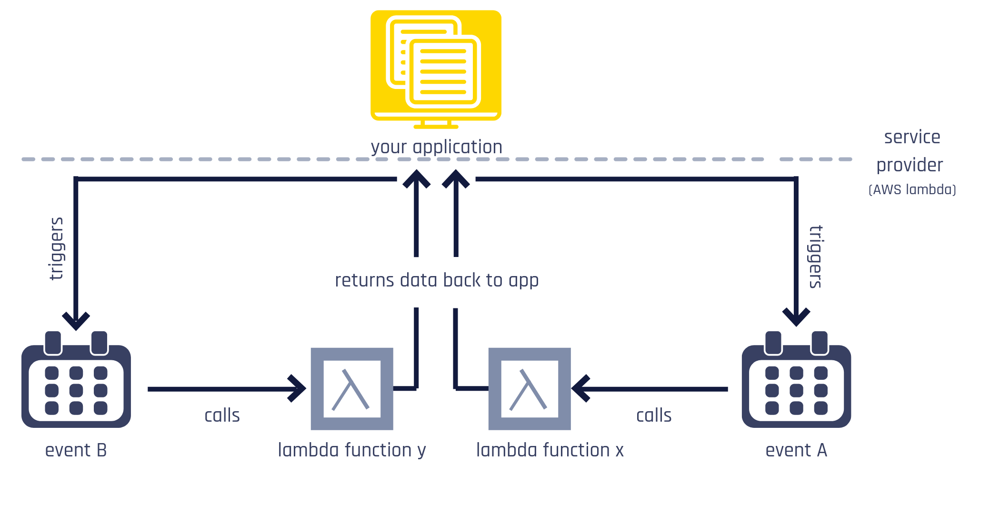
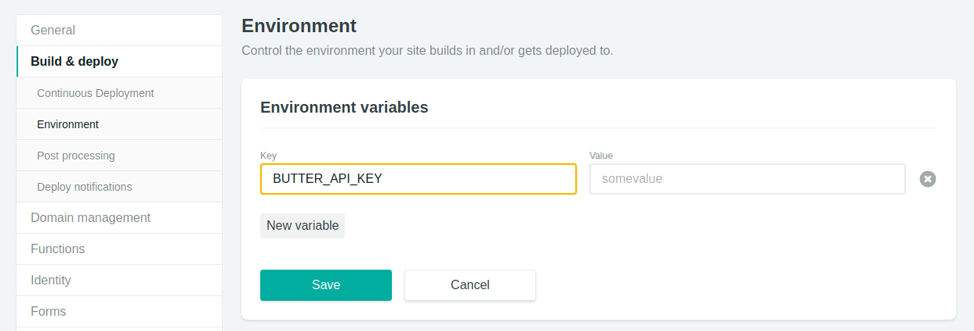

[This article was originally posted in the ButterCMS blog.](https://buttercms.com/blog/what-is-serverless-and-how-to-use-it-in-practice)

In the world of software development, sometimes it might be hard to keep up with all the new trends and buzzwords. Developers love new things, so it’s understandable that preferences and approaches change over time, although it might happen overwhelmingly quick.

One of the latest buzzwords to become popular is serverless. Somehow, it seems to be everywhere now, empowering the newest startups as well as the tech giants. But what is serverless after all? Is it worth knowing?

In this article, I will guide you through learning what serverless really is, the reason why it is so powerful and give you some heuristics to help you decide if serverless is well suited for your project. Later, we will build a simple serverless app using [Netlify](https://www.netlify.com/) and [ButterCMS](https://buttercms.com) to help you better understand the concepts explained throughout the text.

So what is serverless?

## The Serverless Architecture

The first and maybe unexpected thing you need to know about serverless is that it _actually_ has servers. Although it might sound contradictory, this is relieving once you need to keep your back-end separated from the client. Why do we call it “serverless” then?

The main difference between _serverless_ and _serverful_ applications is that for serverless applications, the servers management is taken care of for you. That means they still exist and function as designed, but you are free from the maintenance burden. By “burden” I mean managing availability, scalability, redundancy, uptime, orchestration, and all many other things that are important to modern web applications.

Before digging deeper into our definition, let us first understand why serverless emerged in the first place.

### The motivation behind serverless

Not long ago, applications ran locally in private-owned data centers. This changed when cloud computing became popular, smashing costs and enabling developers and companies to move their infrastructure to the web and focus on their product instead. Companies such as Amazon specialized in developing reliable and distributed data centers that could be accessed anywhere in the world at the same time.

Although this was a turning point for software development, it also brought a new set of problems to be solved ⁠— make sure the server is available at any time, scale up its capacity based on a surge in demand (and conversely scale down during peaceful times), dynamically allocate memory to the most sensitive processes, and so on.

What in the beginning was supposed to be an infrastructure relief ended up becoming a headache once more. Therefore, the demand for headache-free software development was still around (and will likely stay around for as long as software developers live). How do you keep the improvements brought by cloud computing _without_ spending too much time managing the cloud?

The answer is, of course, serverless.

### What is serverless?

I mentioned that serverless architecture, in fact, use servers, but that they are concealed from you. This is still a loose definition, so it’s time to go deeper on this.

The truth is that the definition of serverless varies a lot, some very technical, which can be confusing to newcomers. I’ll start by defining serverless as _architecture_ or _methodology_. Finally, simply put, **serverless architecture is when you perform computations without having to think about machine resource allocation**. That is, the perks of cloud computing are seamlessly integrated into your workflow.

A more technical definition would be the following:

> Serverless is an event-driven, ephemeral and stateless cloud-based architecture that dynamically allocates machine resources.

### Lambda functions

It all sounds too good to be true, but what is underneath a serverless architecture? The key is what we call a _lambda function_.

A _lambda function_ is simply an anonymous function. Consider this JavaScript example:

```js
const multiplyBy = x => {
  return y => x * y
}

const triple = multiplyBy(3)

triple(10) // returns 30
```

Notice that the original function, `multiplyBy`, returns an (anonymous) function. This function has the original value passed to `mutiplyBy` in its scope, what we call closure.

In a serverless application, Lambda functions are invoked, perform the desired operation, and vanishes (that’s why serverless is _ephemeral_). This process is handled by the serverless provider, the most famous being [AWS Lambda](https://aws.amazon.com/lambda/). In the end, all you need to do is to write your function and let the provider call it when it’s time (hence, _event-based_) while doing all machine allocation. Because you don’t control the environment where your code is running, you need to assume a _stateless_ function, i.e., there is no data persistence in between calls.

<figure>
  
  <figcaption>Lambda function diagram.</figcaption>
</figure>

So far we have finally learned _what_ serverless is, conceptually and technically. Next, we will see _why_ it is important.

## Why Serverless? A look at what problems it solves

When developing an application, your prime goal is to focus on the problem you are trying to solve. Ultimately, it means that all work you need to do that is not directly linked to your goal needs to be minimized or, better, eliminated.

If there is a surge in the usage of your app, ideally it shouldn’t make any difference to your users. In reality, though, they might expect slowness, a drop in responsiveness and even no service at all if your server crashes. In order to prevent scenarios like this, you need to invest in good infrastructure. Unfortunately, maintaining such a robust infrastructure is time-consuming and expensive.

How can serverless help you with this dilemma?

### Scales out-of-the-box

Going serverless means that you are offsetting the responsibility of keeping your application stable regardless of the number of users to the service provider. This peace of mind can be hugely beneficial, not only because of the less amount of work but also because of the certainty that your app is going to behave well even in tail scenarios.

### Active upon actual usage

When you assume the responsibility of maintaining a server, you pay for the (virtual) machine you use. That gives you the freedom to control the server and use it however you see fit. Nonetheless, it comes for a price: you pay for that machine even if you are not using. So if your application is only accessed in specific periods of time, you might end up wasting money. Suppose that you have a certificate service that issues certificates to students upon the completion of a course. If the course is still ongoing, there’s no reason to keep the server up, yet you will need to. But in a serverless approach, every request will call a function that will directly impact your bill. This way, when there are no requests there is also no need to pay.

### Cloud lock-ins vs employee lock-ins

If you want top-quality infrastructure management, you will need to assemble a DevOps team. That by itself will start to get expensive, but that’s not the worst of it. The main problem is that _changing personnel is way more difficult than changing a cloud provider_. So if you decide to switch technologies or are not satisfied with the current status of your company’s infrastructure, you will likely have a hard time. However, by adopting a serverless strategy, if you ever need to change providers you can expect a less painful experience.

### Developer experience

It goes without saying that developers… well, like to develop. If you take from them the responsibility to overlook the infrastructure, they will get more productive by keeping their eyes on the end goal, i.e., creating an awesome app. A stressful working environment can kill devs productivity and actual care for their well being will bring you collateral improvements.

Now that we have seen some of the benefits of a serverless approach, let us check when it might make sense to you.

## When to use a Serverless Architecture?

Granted, serverless brings a lot of joy back to development and can be a pretty useful resource. However, if you want to adopt this methodology, it’s indispensable that you know why and if it does help you, and avoid just following the hype.

So, what are some indicators that serverless is a good choice for you?

### Little control over your server

Serverless diminishes your maintenance overhead because you do not own a server anymore. That also means that you can’t do whatever you want, like installing different tools and languages. So if your service provider allows for NodeJS functions, you can’t simply install Python on it and write Django code. Always consider how much control you need.

### Short computations

Lambda functions are event-driven, which means that they are called when something happens (for example, when a user is created). Serverless providers will set a maximum time limit your function can run to avoid that a single call drains all machine’s memory. This limit will vary from provider to provider, but it is important that you realize that if your application performs long and expensive computations, going serverless may be a problem for you.

### Small throughput

We have seen that one advantage of serverless is that you are billed per function request and not by uptime (like traditional hosts such as [DigitalOcean](https://www.digitalocean.com/)). This was interesting in our previous certificate example, but may not be well suited for applications with high throughput, that is, with too many requests per second. Real-time applications that polls the server too much can rapidly increase the cost of your project. Note that it doesn’t necessarily mean that serverless is a bad idea, once all other advantages (even intangible ones, such as developer experience) might be worth the extra cost.

### No data persistence

Because you don’t own the machine, you can’t assume you have access to any files in there either. That means that your Lambda function should be stateless. If your application doesn’t need to persist any state (e.g. save data), serverless becomes really powerful. However, that isn’t the case in most situations. But even when you need to persist data, there is still a silver lining – services like [Amazon DynamoDB](https://aws.amazon.com/dynamodb/) and [MongoDB Atlas](https://www.mongodb.com/cloud/atlas) allow you to save and retrieve data through an API.

### Prototyping

I avoided mentioning prototyping earlier because I wanted to emphasize that serverless is _production-ready_. Top companies are heavily investing in it and there is no reason you should avoid it because of production concerns. That being said, serverless is tremendously helpful when prototyping. Once a prototype or early stage application has no need to bother with auto scale, high throughput, and other infrastructure particularities, going serverless can definitely help you with your MVP.

The topics above are good heuristics for you to ask when considering a serverless architecture. But aside from that, there are also plenty of common use-cases that benefit from being serverless:

- Creating an API to handle subscribing to a newsletter (e.g. integrating with [Mailchimp](https://mailchimp.com/));
- Handling authorization (e.g. using [Netlify’s Identity](https://www.netlify.com/docs/identity/));
- Sending emails (e.g. using [SendGrid](https://sendgrid.com/));
- Building an API gateway to send SMS (e.g. using [Twilio](https://www.twilio.com/blog/a-how-to-send-text-messages-from-your-static-site-using-netlify-twilio-and-serverless-functions));
- And even [playing Pokemon](https://pokeless-eu.rauchg.now.sh/! (Well, maybe not very common)

I encourage you to check the [Netlify’s Function Examples](https://functions.netlify.com/examples/) to get some inspiration of what you can achieve by adopting a serverless architecture.

We have covered serverless in great depth, by defining what it is, understanding why it can be useful and finally learning which situations can benefit the most from this methodology. Next, we will put the theory aside and learn how to create a serverless API in practice.

## Serverless in practice with ButterCMS and Netlify

For the rest of this article, we will build a serverless API using Netlify which will fetch blog posts stored in [ButterCMS](https://buttercms.com/), the headless Content Management System, and group them by month. This is a simple feature but aims to show how you can leverage both Butter and serverless by doing computations in the back-end (and therefore increase the performance of your app). Notice that our application is stateless, once it doesn’t need to persist any data (it will always read from Butter’s API). Finally, we will build a simple front-end to exemplify how you could fetch this data in a real application.

### Setting up the project

Before we start, all code is in [this GitHub repo](https://github.com/rafaelquintanilha/butter-serverless-example) and a simple demo can be accessed here.

Let’s start by creating a new repo using [create-react-app](https://github.com/facebook/create-react-app). If your npm version is 5.2 or higher, npx will be available to you. Otherwise, you can install create-react-app by running `npm install -g create-react-app`.

```sh
npx create-react-app butter-serverless-example
cd butter-serverless-example
```

We will use the power of [Netlify Dev](https://www.netlify.com/products/dev/) in this tutorial. Netlify Dev allows you to replicate Netlify’s environment in your machine. It means that you can develop locally as you are in production, inject env variables, share live URLs and much more. Let us explore what it can do for us.

If you haven’t already, install the Netlify CLI:

```sh
npm install netlify-cli -g
```

Then make sure that you are logged in:

```sh
netlify login
```

Once you are logged in, the next step is to link your folder to a Netlify project. Make sure you have your project created in Netlify. You can easily do that from the UI or use:

```sh
netlify deploy
```

Whatever way you choose, it is pretty straightforward to get it done (I personally like to create a repo in GitHub and then create a new site in Netlify directly from Git). After this, run the following command to link your app:

```sh
netlify link
```

If you have started your project from Git, the CLI will automatically recognize the address. If that’s not the case, you can provide your site’s name or ID in order to finish the process. Both information can be found in your project’s settings page.

### Creating your first function

Once the setup is done we can start by creating our first function. Functions need to live in a folder inside your app, so go ahead and create `src/functions` in your project.

Next, at the root of `butter-serverless-example` create Netlify’s configuration file `netlify.toml` and add the following:

```
[build]
  functions = "src/functions"
```

Which basically points Netlify to the right folder.

Let us use the CLI to create our first function:

```sh
netlify functions:create
```

Many examples will display. They give you an overview of the many possibilities you have with serverless functions. For this example, select the `hello-world` option and name it `posts-by-month`. After that, go check the functions folder and notice that `posts-by-month/posts-by-month.js` is there.

In order to test that everything is working as expected, run `netlify dev` and go to http://localhost:8888. The CRA default app will be there. But how do we test that our function is working?

Every function in Netlify is mapped to a specific URL `/.netlify/functions/<function name>`. Simply go to http://localhost:8888/.netlify/functions/posts-by-month and check that everything works.

### Fetching from Butter

Our `posts-by-month.js` function currently only returns some dummy data. But before we fix that, let us examine closely what is going on:

```jsx
exports.handler = async (event, context) => {
  try {
    const subject = event.queryStringParameters.name || 'World'
    return {
      statusCode: 200,
      body: JSON.stringify({ message: `Hello ${subject}` }),
    }
  } catch (err) {
    return { statusCode: 500, body: err.toString() }
  }
}
```

Every function needs to export a handler, which in this case is an async function (convenient once we will need to asynchronously fetch data from Butter’s API). This function needs to return an object containing a `statusCode` indicating the HTTP Status of the request and a body with the payload. You can learn more about the `handler` method in the [docs](https://www.netlify.com/docs/functions/#the-handler-method).

The process of fetching data from Butter is pretty straightforward. Make sure you have it installed:

```sh
npm install --save buttercms
```

And then setup Butter’s client pretty much how you would do with a regular React app:

```jsx
const Butter = require('buttercms');
const API_KEY = “<YOUR_API_KEY>”;
const butter = Butter(API_KEY);

exports.handler = async (event, context) => {
  try {
    const response = await butter.post.list({page: 1, page_size: 10});
    return {
      statusCode: 200,
      body: JSON.stringify({ data: response.data })
    };
  } catch (err) {
    return { statusCode: 500, body: err.toString() };
  }
};
```

Don’t forget to change `<YOUR_API_KEY>` to your personal key. Go again to http://localhost:8888/.netlify/functions/posts-by-month and verify that it’s returning the correct data.

### Grouping by month

The API is returning data, but that’s not exactly what we want. Ideally, we need to leverage the server processing power to make some computations for us. Let us grab only the published attribute of each post and map it to its corresponding month. The [JavaScript Date object](https://developer.mozilla.org/en-US/docs/Web/JavaScript/Reference/Global_Objects/Date) allows us to do that by creating a `Date` instance and calling the [getMonth](https://developer.mozilla.org/en-US/docs/Web/JavaScript/Reference/Global_Objects/Date/getMonth) method. This method returns a number ranging from 0-11 which represents the months from January to December.

Our function should look like this:

```jsx
...
const response = await butter.post.list({page: 1, page_size: 10});
const postsByMonth = {};
response.data.data
  .map(post => new Date(post.published).getMonth())
  .forEach(monthIndex => {
    if ( postsByMonth[monthIndex] ) postsByMonth[monthIndex]++;
    else postsByMonth[monthIndex] = 1;
  });
return {
  statusCode: 200,
  body: JSON.stringify(postsByMonth)
};
```

Basically, we create a `postsByMonth` object which will hold the total number of posts retrieved by the API for every month that has any record. So if we had 2 posts in April, `postsByMonth[3]` will return `2`. If none were written in March, `postsByMonth[2]` will be `undefined`.

Our API is already achieving our simple requirements, but let’s improve it a bit.

### Limiting the number of returned posts

In the hello world example we paid little attention to this line:

```jsx
const subject = event.queryStringParameters.name || 'World'
```

We can resort to a similar technique to allow the user to set the limit for the query.

```jsx
...
exports.handler = async (event, context) => {
  try {
    const limit = event.queryStringParameters.limit || 10;
    const response = await butter.post.list({page: 1, page_size: limit});
    ...
  };
```

That’s not the only way to pass data to our Lambda function. The body of the request can be accessed via:

```js
const body = JSON.parse(event.body)
```

### Adding an environment variable

Currently, we are hardcoding the API key in the code. This is less problematic than having it in the client, but it’s still suboptimal (you might forget and commit its value to Git, for example). One of the nicest features of Netlify Dev is that it automatically injects all env variables that you have set on Netlify in your local server.

Open your site’s dashboard on Netlify and head to _Settings > Build & Deploy > Environment_. There, click on _Edit Variables_ and add `BUTTER_API_KEY` as “Key” and your API key as “Value”.

<figure>
  
  <figcaption>Netlify environment panel.</figcaption>
</figure>

Next, initialize Butter making sure you read the API key from the env context:

```jsx
const Butter = require('buttercms');
const API_KEY = process.env.BUTTER_API_KEY;
...
```

Restart the dev server and check that it works!

### Calling the API

So far we have been testing our API directly in the browser. In order to exemplify how to consume this data in a real application, let us write a simple front-end that will make the request.

Delete everything in `src/App.js` and replace with:

```jsx
import React from 'react'

function App() {
  return (
    <div>
      <button>Fetch API</button>
    </div>
  )
}

export default App
```

Next, install [isomorphic-fetch](https://www.npmjs.com/package/isomorphic-fetch):

```sh
npm install --save isomorphic-fetch
```

We want to fetch data upon click and then render a table with the count for every month. If a month is not present, it means there were no posts. The full code is as follows:

```jsx
import React, { useState } from 'react'
import fetch from 'isomorphic-fetch'

const indexToMonth = index => {
  switch (index) {
    case 0:
      return 'Jan'

    // Omitted for brevity

    case 11:
      return 'Dec'
    default:
      return ''
  }
}

function App() {
  const [postsByMonth, setPostsByMonth] = useState(null)

  const onClick = async () => {
    try {
      const response = await fetch('/.netlify/functions/posts-by-month')
      const json = await response.json()
      setPostsByMonth(json)
    } catch (e) {
      console.error(e)
    }
  }

  return (
    <div>
      <button onClick={onClick}>Fetch API</button>
      {postsByMonth && (
        <table>
          <thead>
            <tr>
              <th>Month</th>
              <th>Posts</th>
            </tr>
          </thead>
          <tbody>
            {Array(12)
              .fill(0)
              .map((el, i) => (
                <tr key={i}>
                  <td>{indexToMonth(i)}</td>
                  <td>{postsByMonth[i] || 0}</td>
                </tr>
              ))}
          </tbody>
        </table>
      )}
    </div>
  )
}

export default App
```

All we do is to fetch data from our serverless API and save it with `useState`. If you are unfamiliar with React Hooks, check this [comprehensive article](/how-to-reuse-logic-with-react-hooks) which will guide you through what is essential.

Then, we iterate over an array of size 12 (using ES6 [Array.fill](https://developer.mozilla.org/en-US/docs/Web/JavaScript/Reference/Global_Objects/Array/fill) method) and render the correct value for each month. For brevity, I omitted the full extent of `indexToMonth`, but it should be pretty clear.

Go to http://localhost:8888/ and check your serverless-powered app!

<figure>
  
  <figcaption>Fetching data from serverless API.</figcaption>
</figure>

## Final thoughts

Serverless goes way beyond the current hype. It definitely removes development overhead and therefore has inherent value. In the book _Antifragile_, the author Nassim Nicholas Taleb warns us against “overhyping” and “neomania”. According to him:

> “People acquire a new item, feel more satisfied after an initial boost, then rapidly revert to their baseline of well-being. So when you “upgrade”, you feel a boost of satisfaction with changes in technology. But then you get used to it and start hunting for the new new thing.”

We can apply the same principle to software development. Yet, things _do_ evolve and _do_ get better. How can you tell what’s worthy from what’s purely _neomania_?

Taleb exemplifies with wall-to-wall windows. With today’s technology, we can avoid heavy and thick windows that helped our predecessors’ homes stay warm. That approaches humans to nature. In other words, when technology is used to _remove_ a constraint imposed by _technology itself_ in the past.

How can we relate that principle with what we learned today? Serverless connects us with what is really important (developing a great product) by removing the infrastructure burden that was important in the past but can be dispensable in some cases.

Anyway, we have seen that serverless is not a silver bullet. In particular, it might not suit your needs if you need more control over your server.

Finally, combine Netlify with ButterCMS to avoid expensive computations in your clients’ browsers, improve security and enhance the API to fit your requirements.
