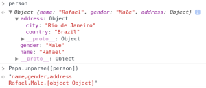

JSON format is very convenient when dealing with web applications. When you are in more traditional grounds, though, it might not be the most recommended. In this tutorial I’ll show how you can easily convert data pulled out from your MongoDB into a CSV file in Meteor.

When I came across this challenge, I took several approaches. MeteorChef has a [pretty complete tutorial](https://themeteorchef.com/tutorials/exporting-data-from-your-meteor-application) explaining how you can export your data into different formats. [@netanelgilad wrote a wrapper to export your data directly to xls/xlsx formats](https://github.com/netanelgilad/meteor-excel/). But in the end of the day I was looking for something more straight and [Papa Parse seemed](https://www.papaparse.com/) to do the trick.

Parsing (or unparsing, as they called) the data did work but in an inflexible way. For example, when dealing with embed documents you would end up with this:



So it doesn’t work out-of-the-box, but let’s not blame the poor guys from Papa Parse! There’s a pretty simple workaround for it. In this tutorial we will build a contacts application (I feel like I need to be more creative) that has some data and options to export either all your contacts or a single one in the convenient CSV format. To make things a little tougher we will deal with embed documents and data manipulation.

[There is a repository for this project in GitHub](https://github.com/rafaelquintanilha/meteor-json-to-csv) if you want to see what we will build. Experiment to git clone and play with the data alongside with this tutorial.

## Creating the Project

To start, go to your terminal and run the following:

```bash
$ meteor create papa-unparse
$ cd papa-unparse
$ meteor add harrison:papa-parse
$ meteor add momentjs:moment
$ meteor add iron:router
```

You have now successfully created your Meteor project and added the Papa Parse, MomentJS (we will need it to format our date) and Iron Router packages. That should be enough for our purposes today.

Remove the files automatically generated by Meteor and create three folders: *client*, *both* and *server*.

## Adding Some Data

In your *both/* folder, create **collections.js** and add the following:

```js
Contacts = new Meteor.Collection("Contacts");
```

We will not explicitly set the schema (you might want to use [aldeed:simple-schema](https://github.com/aldeed/meteor-simple-schema)) but let’s define our contacts will have: name, gender, address (simplified to just store country and city) and createdAt.

Create a CRUD interface is beyond the purpose of this tutorial. No shame on it. Go to _server/_, create **init.js** and add:

```js
Meteor.startup(function() {
  if ( Contacts.find().count() === 0 ) {
    Contacts.insert({
      name: "Rafael",
      gender: "Male",
      address: {
          country: "Brazil",
          city: "Rio de Janeiro"
      },
      createdAt: new Date
    });
 
    Contacts.insert({
      name: "John",
      gender: "Male",
      address: {
          country: "Australia",
          city: "Melbourne"
      },
      createdAt: moment(new Date).subtract(1, "days")._d
    });
 
    Contacts.insert({
      name: "Marie",
      gender: "Female",
      address: {
          country: "France",
          city: "Paris"
      },
      createdAt: moment(new Date).subtract(7, "days")._d
    });
  }
});
```

The only trick here is to use moment to create different dates — for the sake of making the data less boring. Follow [their documentation](https://momentjs.com/docs/) if you want to learn more.

## Designing the Application

Now that we have data it’s time to play with it. In _clients/_ create two files: **main.html** and **main.js** (not the best practice, I know, but let’s stick to our needs here). In **main.html**:

```js
<head>
  <title>Papa Unparse</title>
  <meta name="viewport" content="width=device-width, initial-scale=1, maximum-scale=1, user-scalable=no">
</head>
 
<template name="layout">
  {{> yield}}
</template>
 
<template name="contacts">
	<button id="export">Export All</button>
	<br><br>
	<table>
		<tr>
			<th>Name</th>
			<th>Action</th>
		</tr>
		{{#each contacts}}
		<tr>
			<td>{{name}}</td>			
			<td><a href="{{pathFor route='contact'}}">View</a></td>
		</tr>
		{{/each}}
	</table>
</template>
 
<template name="contact">
	<button id="export">Export</button>
	<br>
	{{#with contact}}
	<div>
		<p><b>Name:</b> {{name}}</p>
		<p><b>Gender:</b> {{gender}}</p>
		<p><b>Date of Affiliation:</b> {{formatDate createdAt}}</p>
		<p><b>Country:</b> {{address.country}}</p>
		<p><b>City:</b> {{address.city}}</p>
	</div>
	{{/with}}
</template>
```

The code should be straightforward. We define two templates, **contacts** and **contact** that will show respectively all contacts in our collection and a single one. If you are not familiar with Iron Router, [go check their documentation](https://github.com/iron-meteor/iron-router/blob/devel/Guide.md).

Of course we haven’t defined the helpers. In **main.js**:

```js
Template.registerHelper("formatDate", function(date) {
	return moment.utc(date).format("DD/MM/YYYY");
});

Template.contacts.helpers({
	contacts: function() {
		return Contacts.find({}, {name: 1});
	}
});

Template.contact.helpers({
	contact: function() {
		return Contacts.findOne(Router.current().params._id);
	}
});
```

Note the `registerHelper` method we use to avoid duplicate the `formatDate(date)` function. Nice.

Last piece of the puzzle, time for set the router up. In _both/_, create a **router.js** file and add the following:

```js
Router.configure({
  layoutTemplate: 'layout'
});

Router.map(function() {
  this.route('contacts', {path: '/'}),
  this.route('contact', {path: 'contact/:_id'})
});
```

That’s all. Experiment to run your application and see everything is alright. You should see a list with all names in a table and a hyperlink that shows more details about that contact. Sounds like it’s time for doing some exportation.

## Export!

Papa Parse is client-side so you will need all your JSON data in there. That’s no big deal – you would download it anyway. Nevertheless, you might want data that it’s not in the client. For example, our contacts template only show the name of the contact. Imagine the scenario when we are using subscriptions and that’s the only data available – you would have to request the remaining from the server.

With that in mind, our logic becomes: client clicks in export button -> server gathers data and builds JSON -> server handles JSON array to client -> client converts to CSV and downloads file.

All good? Now note that apart from the server gathering data, the rest of the process is the same for any export you might do. To avoid code duplication, let’s create a global helper which handles that for you. There’s many ways of achieving and it’s a matter of flavor. In this tutorial, create a file **exporter.js** in _client/_ with the following code:

```js
MyAppExporter = {
	exportAllContacts: function() {
		var self = this;
		Meteor.call("exportAllContacts", function(error, data) {

			if ( error ) {
				alert(error); 
				return false;
			}
			
			var csv = Papa.unparse(data);
			self._downloadCSV(csv);
		});
	},

	exportContact: function(id) {
		var self = this;
		Meteor.call("exportContact", id, function(error, data) {

			if ( error ) {
				alert(error); 
				return false;
			}
			
			var csv = Papa.unparse(data);
			self._downloadCSV(csv);
		});
	},

	_downloadCSV: function(csv) {
		var blob = new Blob([csv]);
		var a = window.document.createElement("a");
	    a.href = window.URL.createObjectURL(blob, {type: "text/plain"});
	    a.download = "contacts.csv";
	    document.body.appendChild(a);
	    a.click();
	    document.body.removeChild(a);
	}
}
```

The first two functions are pretty alike. They call a Meteor method and wait for the data to unparse them using Papa Parse. Once you have the CSV string a private function is called and the download starts. A note: downloading a file via browser might raise some cross-browser issues. The above solution works well both in Chrome and Firefox ([thanks to @mholt in this post](https://github.com/mholt/PapaParse/issues/175)).

Alright, now we switch roles and dive deep into the server realm. Make sure you are in _server/_ and create a file called **export.js**. Before adding any content, let’s understand how Papa works.

[There are many ways](https://www.papaparse.com/docs#json-to-csv) to parse a JSON data to CSV. The one I like most is to pass an object that contains an array with the fields name and after an array of arrays with the proper data. Using this approach gives us the flexibility to iterate over embed documents and format any data.

Enough of talking, add the following:

```js
Meteor.methods({
	exportAllContacts: function() {		
		var fields = [
			"Name",
			"Gender",
			"Date of Affiliation",
			"Country",
			"City"			
		];

		var data = [];		

		var contacts = Contacts.find().fetch();
		_.each(contacts, function(c) {
			data.push([
				c.name,
				c.gender,				
				moment.utc(c.createdAt).format("DD/MM/YYYY"),
				c.address.country,
				c.address.city
			]);
		});

		return {fields: fields, data: data};
	},

	exportContact: function(id) {		
		var fields = [
			"Name",
			"Gender",
			"Date of Affiliation",
			"Country",
			"City"			
		];

		var data = [];		

		var c = Contacts.findOne(id);		
		data.push([
			c.name,
			c.gender,				
			moment.utc(c.createdAt).format("DD/MM/YYYY"),
			c.address.country,
			c.address.city
		]);

		return {fields: fields, data: data};
	}	
});
```

Note that once we are on the server any query can be made to our MongoDB. In particular we are retrieving all fields from Contacts, even though only the name was displayed before. To satisfy our requirements, we are now able to access embed documents (c.address.country) and apply some function to the data (for example, formatting dates).

Finally, let’s make the buttons alive! Go back to **main.js** and add to the bottom:

```js
...

Template.contacts.events({
  "click #export": function() {
    MyAppExporter.exportAllContacts();
  }
});

Template.contact.events({
  "click #export": function() {
    MyAppExporter.exportContact(Router.current().params._id);
  }
});
```

And that’s it. You should have an application that exports data pulled out from your MongoDB in a nice CSV file well suited for integration with other programs (think Excel).

Please feel free to give any feedback you might consider!