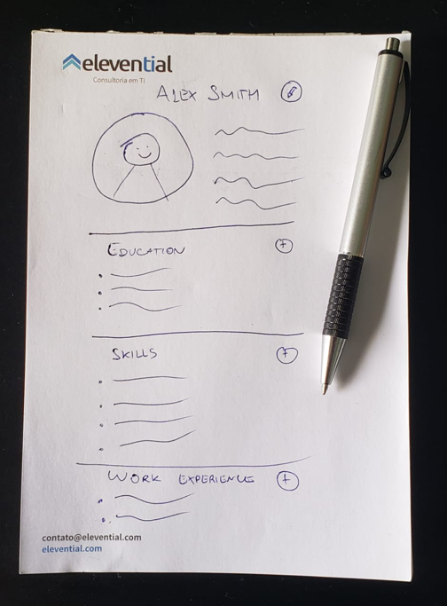
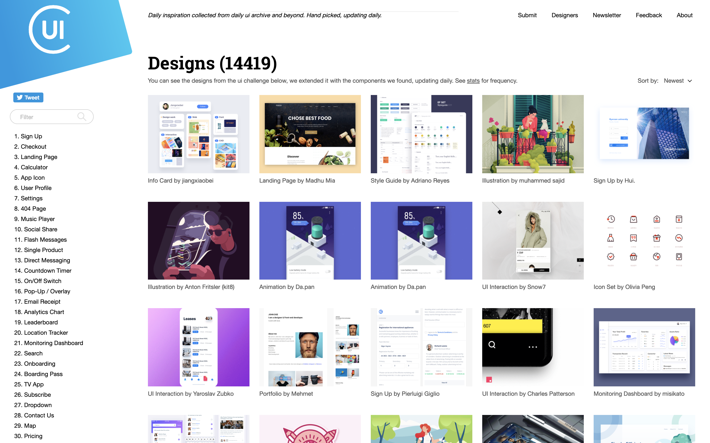
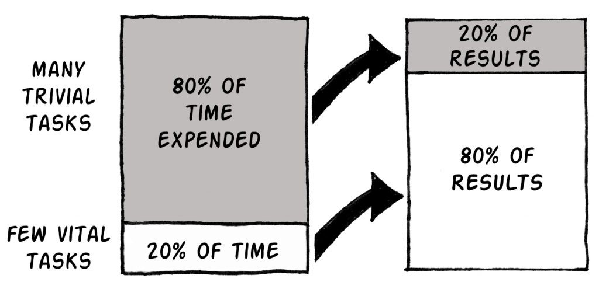

[This article was originally posted in the ButterCMS blog.](https://buttercms.com/blog/front-end-developer-best-practices-to-design-react-ui-framework)

## Introduction

It is not uncommon for a client to have only a fuzzy idea about an app. They might be only experimenting, with an incomplete business model and many times lacking technical background. As a CTO, being able to handle this situation can be a game-changer between a frustrated client and a successful product.

A software, during its conception, is a simple abstraction. You imagine what you would like to achieve, but you can’t do it until it comes to existence (at least partially). That’s why front-end work is really important - it bridges the gap between what your clients imagine to what they see.

By quickly presenting clients something visual you can gather much more relevant feedback, avoid early pitfalls and significantly increase the likelihood of success. Besides, chances are your clients won’t care about magnificent back-end work, since they can’t see it directly! For non-technical people, the reality is that the UI will cause much more impact.

This article aims to provide you with a simple guide of how to efficiently prototype a front-end application using React. **The information you will find here has been compiled during several years of consulting work and contains feedback from many clients**.

## The right tools for the job

When seeking efficiency, it is mandatory to use the right tooling. This is not a debate of which technology or framework is better for your project, but rather what tools can increase your velocity *given* your stack’s choice (in our case, React).

#### Starters

You don’t want to waste time optimizing your webpack or installing Babel plugins during this phase, so a good starter is recommended. There are many, but I’ll emphasize the following:

- [create-react-app](https://facebook.github.io/create-react-app/): with a single command line, fire up a React application. It has drop-in functionalities but also the ability to change advanced settings. It is maintained by the React team, so you can expect a continuous development and improvement. It is less opinionated, meaning that you still have to tweak it a bit (e.g. add routing).
- [GatsbyJS](https://www.gatsbyjs.org/): create blazing fast apps with outstanding features like pre-fetching, code splitting, and offline support out-of-the-box. Comes with its own routing solution by and uses GraphQL as an interface for fetching data.
- [NextJS](https://nextjs.org/): similar to Gatsby, but focused on server-side rendering, which means enhanced SEO capabilities (although you might not be much interested in that in a prototype) and universal rendering (JavaScript everywhere).

The truth is that you will be fine with any of them. Personally, I like to use Gatsby when the project is front-end heavy (meaning a lot of static pages and few connections with the server). If I need more freedom to use the libraries I want, CRA would be my choice. Finally, if I’m more concerned about the back-end and willing to use JavaScript in there, NextJS is very suitable.

#### Deployment

One of the greatest advantages of doing front-end work is that deploying and sharing has become trivial. There are many free solutions that allow you to deploy your prototype in literally a couple minutes. 

You can achieve that with [Netlify](https://www.netlify.com/), [Now](https://zeit.co/now) and [Surge](https://surge.sh/) (among others). All of them will cover your back and provide HTTPS support, custom domains, and continuous development. Particularly, I’m very fond of Netlify and find their deployment process insanely trivial. Simple connect your GitHub or BitBucket account, push your code and wait a few seconds until your app is available on the internet.

The power of firing up a static website with a custom domain and share it with your clients is priceless. It is a good strategy to bring them close to the development, ask them for help to test multiple devices and as a consequence have them gathering feedback and finding bugs much earlier.

# The very beginning

Now that you have decided your starter and are able to deploy and share a “Hello World” with your client in 5 minutes, it is time to start designing your UI for your React app.

As a non-designer, my first instinct is to draft a rough version of the interface. This process helps me to turn something abstract into concrete. 

Suppose your client wants to develop a resumé application, where users can fill personal information, work experience, relevant skills, and educational background. Stop for a few minutes and try to picture this application in your head. How is every section displayed? Do you anticipate users will need to upload a photo? Have you ever seen software that does something *similar* to that? If that’s the case, what’s good about it?

Here’s what I came up with:

<figure>
  
  <figcaption>A simple and rough draft can help you as a starting point.</figcaption>
</figure>

As you can see, I’m no Pablo Picasso. But that’s OK -- I’m not interested in the final design yet, just a base layout. Once I have that, I can start positioning HTML elements, add some CSS,  and get some feedback. 

#### Look for inspiration

Having a starting point is good but you don’t want to showcase an app that looks like it was built in 1996. In order to give a little glamour to your sketch, you can start looking for inspiration.

As I already mentioned, a good way to start is to find out apps with similar features. In our example, [LinkedIn](https://www.linkedin.com/) is certainly a match. Important: *you don’t want to make a copy*. But if your users can easily relate to the interface, it’s a win. Notice the styling trends. Details can really make a difference here: padding, font sizes, text and background colors, shadows, etc. 

It’s also a good idea to search for particular UI designs. A good website for this is [Collect UI](http://collectui.com). While I don’t expect to come up with fancy animations, I do get a lot of good inspirations from their gallery.

<figure>
  
  <figcaption>Collect UI can help you with inspiration.</figcaption>
</figure>

Finally, there are libs that provide a collection of common components such as buttons, form components, headers, etc. One of my favorites is [Semantic UI React](https://react.semantic-ui.com/), which is extensible and customizable. Picking a good collection can save you a lot of time.

#### Start with HTML and CSS

It’s time to convert the sketch and your inspirations into code. You are moving one step further in the concreteness of your app. How’s the best way of doing it?

The simpler way is to start with HTML and CSS only, even though you are using a React starter. Start laying DOM elements around, try different styles. Change the positioning, colors, borders. Aggregate related pieces of UI but don’t try to over-engineer yet: no need to start decomposing your UI into multiple React elements or caring about reusability. Surely, this will need to be done. But at this moment, free your mind from framework specifics and care about how your app should *look*.

During this phase, I avoid adding much interaction or special effects. If you envision a magnificent hover effect on the button or would like to dynamically add skills to your résumé, leave this aside for the moment. 

Beware of 3rd party libraries that can add complexity - no need to install the awesome [react-dropzone](https://github.com/react-dropzone/react-dropzone) package yet even though it would be cool to let users add new avatars at this point. First, chances are you still have a lot of loose ends - what if the avatar should be added in a “My Account” page? Or if the client requires the ability to crop the photo? What about different images extensions? Ultimately, now isn’t the right timing. Second, prioritize: if you run out of time, would you rather have the full layout done with a placeholder avatar or a half-baked page which allows drag and drop?

#### Don't be careless

Most of my tips so far were pragmatic. You should focus on having a layout done and being able to share it with your client. Likely, your deadline is short (as with every deadline). You are tempted to create the first design it came to your mind, host it in Netlify and send the URL via email.

**Don’t do it.**

Although I sound contradictory, there’s a good reason for that: *you don’t want your job to be recognized as lazy or reckless*. It is very important to make a good first impression or you can frustrate your client. That doesn’t mean you need to redo your design ten times before asking for feedback - but bear in mind that you will be judged by the quality of your UI, even though you swear that “this is just a first draft and of course will be improved”.

When your design looks professional enough, so that when you compare to your inspirations it doesn’t look like it was done in a rush by an undergrad student, you are good to go.

## Add interactivity

At this point, you should have a better understanding of what your app needs to do. It’s time to transform this web page into a web app. Let the fun begin!

#### Low-hanging fruits

Start small. What features do your clients want that you can do in the shortest amount of time? Those are the ideal initial candidates. 

In our sketch, there is a plus button on the right side of each section. Suppose one requirement is to dynamically add items into them. Well, React makes this kind of behavior pretty easy and it is hard to imagine the app without this feature. If your clients ever change their minds and want to add new items, say, through a modal window, you didn’t waste too much time.

#### Don’t show off

JavaScript is arguably the most complex part of the development and that’s why you want to keep it under control. While you might have already envisioned fancy interactions for the software you are building, resist the temptation to “show off”. 

First, you are in the realm where the complex logic lives. If you make a misjudgment and a feature proves to be harder to implement than anticipated, you can get frustrated too soon and compromise the deadline.

Second, you don’t want to set a trap to yourself. Suppose that for each item in the sections you want to be able to delete them. How are you going to do it?

Surely, there are many ways. You can have a minus button that shows up on hover right after each item and removes it when clicked. You can also have a checkbox on the left side and a button to delete all marked items. What about being able to drag every item and drop them into a trash can?

None of the three options are necessarily *better* than the other. But you can easily identify the simpler one. The one that leaves less room for interpretation is preferred. In this example, where should the “Delete” button be? Are the checkboxes always visible? Is necessary to have a “Select All” option? For the drag and drop solution, what about mobile devices? Are you expected to support all OS? Where the trash can should be? Do you need a 3rd party library?

Make sure *you* are not the one who is adding complexity to the project.

#### Focus on the happy path

A real-world web application shouldn’t allow users to do whatever they want. For instance, if you are adding a new item to the Skills section, you certainly shouldn’t be able to add a 2,000-word essay.

Still, this kind of work can be cumbersome and less valuable. If your clients want to test the application and validate their views, adding a really long string as a skill item might not be a concern yet. They may not even realize that you are performing a validation!

It’s important that you define with your client the *happy path*, that is, the most common scenario that users fall into without nothing unexpected happening. In our example, it can be the user going to their profile, populating every section with valid information and saving. This is a useful and testable scenario.

Leave the edge cases for later. Recall the [Pareto Principle](https://en.wikipedia.org/wiki/Pareto_principle), or the 80/20 rule: 80% of the scenarios are done with 20% of the work.

<figure>
  
  <figcaption>Visual explanation of the Pareto Principle.</figcaption>
</figure>

## Decouple the UI from the back-end

There is no doubt that back-end development is crucial for the success of your application. However, if your goal is to quickly prototype an interface, you can live without it.

The main reason is that most of the optimizations and improvements that the back-end brings are not very relevant at this stage. As mentioned before, it is likely that your clients don’t care much about you using the right ORM or automatically scaling in AWS. Again, that doesn’t mean they have no value - only that there are other things to focus right now.

#### Separate the UI from the API

React is not very opinionated and therefore every developer is allowed to have their own preferences about how to split logic, create UI elements, manage side-effects, etc. Many patterns emerged from the community as a response to standardize procedures but in the end, this is your responsibility.

In the old days, people would talk about “Smart” and “Dumb” components. That evolved to the more politically correct terms “Stateful” and “Pure” or “Container” and “Presentational”. Ultimately, they all share the same goal: separate complex logic and stateful representations from what is UI only.

Why is that a thing? Well, “Presentational” components are much easier to implement. They are simple React components with little or no knowledge of the business logic, let alone API particularities. If you are building a dynamic list of skills, you certainly can start by developing the list and the items without minding too much if you are fetching this information from a REST API or a GraphQL server. 

#### Hooks are your friends

[There is a famous post from Dan Abramov](https://medium.com/@dan_abramov/smart-and-dumb-components-7ca2f9a7c7d0) explaining his views about the topic above. However, the original post is from 2015 and [just recently React launched official support for hooks](https://reactjs.org/blog/2019/02/06/react-v16.8.0.html).

As mentioned in the article, hooks are another way of looking at the separation of concerns. Instead of reusing *components*, you can now reuse *logic*. This new paradigm speeds up development a *lot*. For example, suppose that your client requires some keyboard shortcuts such as pressing Ctrl + N to create a new item. You already have the UI for the items and likely an `addItem` function. In this case, all you need to do is *hook* the required logic into the UI. [useKeyPress](https://usehooks.com/useKeyPress/) will then make your life a breeze.

#### Prepare the terrain for real data

If you successfully separate what is only UI from what is complex logic or API calls, the development process will become way smoother. That being the case, you can prepare your components for fetching data even if you don’t have an endpoint yet!

Assume you want to create an “Edit Profile” page for our sample application. This would involve fetching data from the API and filling the correspondent fields. In terms of front-end development, you don’t need to wait for the back-end and database to be set to start working on it. Create a mock object which will mimic the response from the API (what makes designing the API extremely important) and feed it into your “Pure” or “Presentational” component.

If you need to persist data, e.g. be able to edit the profile, click on save and see the changes when you refresh the screen, experiment the local storage. Although not recommended in production, it will work just fine for prototypes. If you are into hooks, there is a [useLocalStorage](https://usehooks.com/useLocalStorage/) hook that trivializes this process.

When the time comes, succeeding at this phase will make switching to real data an effortless process. 

## Final thoughts

All tips included in this article are a personal compilation of years of front-end development. This is not intended to be a final manual of some sorts, but to provide guidance on how to efficiently handle clients requests and keep project quality. 

The main takeaways can be summarized in the following points:

- *Communicate early*. The sooner you get feedback, the less time you will spend redoing work. This is somewhat expected when you are on the prototyping phase, so doing this efficiently will positively impact your velocity.
- *Avoid edge-cases*. Remember that you can cover 80% of the scenarios with 20% of the work. Do your clients a favor and have more meaningful features done in less time.
- *Don’t over-engineer*. Prototypes are fragile, likely to be modified and sometimes frustrating to develop. You don’t want to spend too much time abstracting just to find out that everything will change.
- *Design the API*. Clients will judge the interface first so you should put more effort into making it right. However, make sure you have a clear design of the API so, when it’s time, you can plug front-end and back-end seamlessly. 

