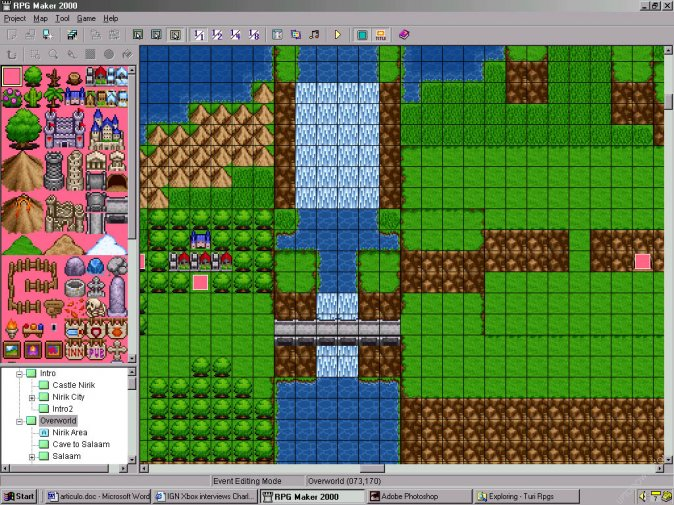
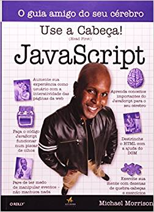

Esse post inicia uma série sobre desenvolvimento web. Aqui, pretendo escrever conteúdos em português voltados para iniciantes na área, que tenham pouco ou nenhum contato com programação, mas interesse em desenvolver suas habilidades como programadores web.

Mas antes de explicar de forma completa o que constará nessa série, permita-me uma breve disgressão.

## Uma Interface Vale Mais que Mil Palavras

Meu primeiro contato com a programação aconteceu por meio do RPG Maker -- uma ferramenta que permitia que jogos de RPG em 2D fossem criados de forma muito simples e intuitiva. Apesar da simplicidade, o RPG Maker me introduziu conceitos que eu usaria bastante no futuro: variáveis, controle de fluxo (`if/else`), *switches*, etc.

<figure>
  
  <figcaption>Interface do RPG Maker, onde tudo começou.</figcaption>
</figure>

Mas talvez o principal legado da minha época de RPG Maker foi o apreço pelo *visual* - criar um jogo e *ver* o que estava acontecendo, testar, mostrar para meus pais e amigos, fazia toda a diferença. É possível que essa seja a origem do meu interesse pelo *front-end*, ou por programar qualquer coisa que tenha uma interface com um humano.

Mas o que exatamente é o *front-end*?

## O Restaurante Mexicano

Imagine-se indo a um restaurante mexicano. O ambiente é alegremente decorado com as cores do México. Um rapaz vestido como um *mariachi* toca uma música típica ao fundo. Um garçom simpático utilizando um *sombrero* se aproxima e entrega-lhe o cardápio, que é grande e cujos itens estão escritos em letras garrafais. Após algum tempo de reflexão você pede nachos com guacamole (especialidade da casa). Com um sorriso no rosto, o garçom anota o seu pedido e se retira em direção à cozinha.

<figure>
  
  <figcaption>Um restaurante mexicano igual a todos os outros restaurantes mexicanos.</figcaption>
</figure>

Algum tempo depois ele retorna com seu prato. Você termina a refeição com calma e pede a conta. O garçom lhe oferece a maquininha, você passa seu cartão e vai embora. Fim da experiência.

Você acabou de ser *cliente* de um *serviço*. Você consumiu esse serviço não apenas com a pretensão de se alimentar, mas também de ir a um ambiente agradável, com um bom atendimento, e claro, uma boa comida.

O que isso tem a ver com programação?

Toda a interação do serviço com você (o cliente) é o que compõe o *front-end*. Em outras palavras, é a *interface* entre o serviço e o usuário. Isso não inclui apenas o atendimento do garçom, mas também tudo que compõe a experiência (o ambiente ser esteticamente agradável, o *mariachi*, o atendimento rápido, etc).

Ainda assim, existe uma parte do serviço que não é visível a você. Por exemplo, a organização da cozinha, a qualidade dos ingredientes, a higiene dos cozinheiros, a determinação de quais garçons atendem quais mesas, etc. A essa parte damos o nome de *back-end*.

Em outras palavras, podemos dizer que o **front-end é a interface do serviço com o cliente**.

#### Na Prática

A analogia acima serve para exemplificar os conceitos. No contexto da programação web, não temos nachos nem *sombreros*, mas tecnologias específicas que podem ser usadas para construir tanto o front quanto o back-end.

O desenvolvedor front-end utilizará **HTML**, **CSS** e **JavaScript** para construir suas aplicações. Nos próximos posts dessa série eu exemplificarei com mais detalhe cada uma dessas tecnologias e qual seu papel dentro de uma aplicação web.

Já o desenvolvedor back-end tem mais flexibilidade na escolha de sua tecnologia. Podem ser utilizadas várias linguagens de programação, como **Python**, **Java**, **PHP** e **JavaScript**. 

O código do back-end vive em um *servidor*, que no contexto de uma aplicação web é acessado por um *navegador* (como Chrome ou Firefox). O navegador é então o *cliente* do *serviço*.

## Iniciando na Web

Existem diversos recursos para quem deseja aprender desenvolver para a web. Embora a quantidade de material em português venha aumentando, a maioria esmagadora ainda é em inglês (como os posts desse próprio blog). 

Portanto, a ideia é começar uma série de artigos justamente para suprir a falta de material de qualidade na área, reforçando o que eu considero ser as principais habilidades que o mercado requer de um programador front-end *hoje*.

Naturalmente, uma aplicação web dificilmente vive sem back-end ou banco de dados, então trataremos desses assuntos também (embora em menos detalhes). 

#### Não Deixe a Faculdade Atrapalhar Seus Estudos

A frase é provocativa mas sincera. Sou formado em Engenharia de Computação e Informação pela UFRJ, e nos 5 longos anos que frequentei a faculdade não tive uma única aula de programação para a  web.

<figure>
  
  <figcaption>Meu primeiro livro sobre JavaScript.</figcaption>
</figure>

O que me fez trabalhar na área foi, por pura e simples curiosidade, ter comprado um livro sobre JavaScript. Após estudar sozinho por um tempo e criar meu primeiro app, no final de 2012 apliquei com sucesso para um estágio na área. Essa decisão me deu uma carreira, que sigo aprimorando até hoje.

#### Um Mercado para Chamar de Seu

Em 2015 eu decidi, junto com outros dois sócios, criar a [Elevential](https://elevential.com), uma empresa de consultoria em TI. Fizemos vários processos seletivos desde então e pude notar, para meu desgosto, que a oferta de programadores front-end é consideravelmente menor que programadores back-end.

Acredito que essa distorção aconteça por três motivos principais:

- A maioria das linguagens modernas podem ser utilizadas no back-end. Então alguém que seja novo em programação pode começar estudando Python ou Java sem necessariamente ficar "preso" ao contexto web. JavaScript, por sua vez, é usado majoritariamente para aplicações web.
- Front-end é um assunto renegado na maioria das universidades. Mesmo pessoas com formação técnica precisam aprender sobre o assunto de forma auto-didata.
- Aplicações web são adventos relativamente novos. Há pouco tempo substituímos aplicações nativas (como Outlook e Excel) por aplicações web (como Gmail e Google Sheets). A boa notícia (para os *front-enders*) é que essa é uma tendência que cada vez mais ganha força.

#### Front-end do Jeito "Certo"

Obviamente "certo" e "errado" são conceitos subjetivos no contexto de qualquer aprendizado. Entretanto, eu me dou licença poética para focar no que *eu* considero ser as principais habilidades para um desenvolvedor front-end (após anos de experiência desenvolvendo dezenas de projetos no Brasil e mais recentemente nos EUA). Isso não significa apenas saber bastante **HTML**, **CSS** e **JavaScript** (o que é indispensável), mas também:

- Ter noções de **UI** (User Interface) e **UX** (User Experience). Lembre-se que no restaurante mexicano a decoração e o *mariachi* fazem parte da experiência.
- Entender **acessibilidade**. Existe uma forte tendência para tornar aplicações web mais acessíveis, e por uma boa razão. Isso significa não só um foco em usuários com *disabilities*, mas também numa preocupação em deixar o app facilmente operável (por exemplo, usando apenas o teclado). Na nossa analogia, um cuidado com acessibilidade vai desde rampas de acesso para cadeirantes a cardápios com textos legíveis e cores contrastantes.
- Tirar vantagem da **semantic web**. *Buzzword* à parte, o HTML vem evoluindo para se tornar cada vez mais semântico, ou seja, não apenas renderizar elementos na tela mas também dá-los significados. Isso é importante para áreas como SEO (como o Google intui o que é relevante no seu site e posteriormente indexa no resultado das pesquisas) e uso de *screen readers* (leitores de tela), novamente importantes no contexto de uma web mais acessível.
- Saber trabalhar em equipe (designers e programadores back-end), cumprir prazos, estimar e priorizar o seu trabalho, etc. Recentemente eu [escrevi um artigo sobre o assunto](https://rafaelquintanilha.com/how-to-efficiently-go-from-idea-to-prototype-in-react/) (em inglês), mas focaremos em mais nuances ao longo da série.

Assim como não analisamos um restaurante apenas pela comida, não analisamos um app apenas pela sua funcionalidade (o que ele se propõe a fazer). Avaliamos o *look and feel*, a facilidade de uso, a fluidez, rapidez, etc. Entender todos esses conceitos é o que te faz um bom programador/desenvolvedor/engenheiro front-end. Pense no que diferencia um Macbook de um Positivo, o Whatsapp de um app de mensagem qualquer ou carros de luxo de carros populares.

## Próximos Passos

Nos próximos artigos diminuirei o blá-blá-blá e explicarei tudo que você precisa saber e ter em mãos para escrever o seu primeiro site. Depois, criaremos juntos seu primeiro app, de forma incremental -- e claro, do jeito "certo".