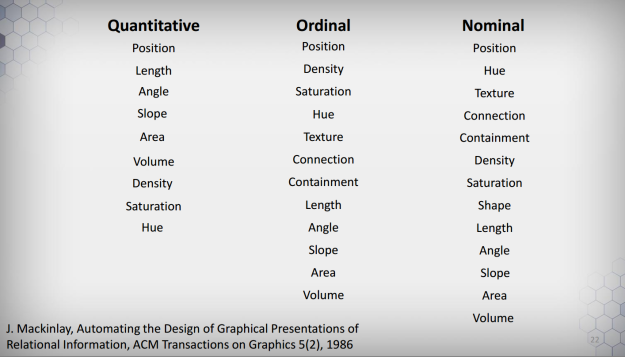

Data Visualization is an important concept in nowadays applications and line charts are often chosen as representation. This is no coincidence: studies show that position is the most efficient way for humans to perceive differences in data. The following image is a slide extracted from the [amazing Data Visualization course offered by Coursera](https://www.coursera.org/learn/datavisualization).



The above slide ranks (from top to bottom) which kind of representation is best applied given the type of the data (Quantitative, Ordinal or Nominal). An easy takeaway is that you can’t go wrong with Position, which turns out to be exactly what we measure with Line Charts.

The thing is, knowing or not the theory behind Data Visualization, line charts are ubiquitous and an important abstraction for any developer. That said, I always felt frustrated about the many libraries out there to implement this simple visualization. Many would lack basic features (such as adding multi lines or changing line colors) or would be extremely low-level (think d3).

Of course wouldn’t be fair to state that every library that implement this is bad. In the React realm I am particularly fond of [Uber’s React Vis](https://github.com/uber/react-vis). Again I would fail to tweak with it (maybe because of my own inability).

I have been working with React for a long time, so I knew I would have to solve this problem often. Then I went the natural path and tried to make my own, simple yet highly customizable, library: **React LineChart** – and that’s what we gonna learn today (this sounds so narcissistic.)

You can check some of the features provided by the lib in the [live example](/apps/linechart/) and [follow the documentation on GitHub](https://github.com/rafaelquintanilha/react-linechart).

In order to learn how to use this tool and to explain some of the design decisions I made, let’s build an app from scratch. Enough of talking, let’s get into it!

## <a name="getting-started" href="#getting-started">Getting Started</a>

We gonna take advantage of the [awesome Create React App](https://reactjs.org/blog/2016/07/22/create-apps-with-no-configuration.html) command. If you don’t know it, it’s time to visit the link and give it a head’s up. In any case there isn’t much to learn: all you need to do is run the following commands:

```bash
npm install -g create-react-app
create-react-app linechart-example
```

It is pleasantly easy – forget about minding Babel, Webpack or CDN scripts. You can test the boilerplate app React right away:

```bash
cd linechart-example
npm start
```

You can now check the few dependencies CRA has introduced for you looking at *package.json*. Not many really. Once we are already talking about that, time to install the lib:

```bash
npm install --save react-linechart
```

This will pull the latest version published on NPM. [You can check it online](https://www.npmjs.com/package/react-linechart). A note of caution: this was my first ever NPM package, so I cannot say to have avoided possible mistakes during the course of creating the library (versioning is weird too, I know).

Great! You have all the tooling ready to start (it’s beautiful how easy this section has become…)

## <a name="the-basics" href="#the-basics">The Basics</a>

You can now navigate to *src/App.js* and get rid of everything is in there. Replace it with:

```jsx
import React, { Component } from 'react';
import LineChart from 'react-linechart';
import '../node_modules/react-linechart/dist/styles.css';

export default class App extends Component {
	render() {
		const data = [
			{									
				color: "steelblue", 
				points: [{x: 1, y: 2}, {x: 3, y: 5}, {x: 7, y: -3}] 
			}
		];
		return (
			<div>
				<div className="App">
					<h1>My First LineChart</h1>
					<LineChart 
						width={600}
						height={400}
						data={data}
					/>
				</div>				
			</div>
		);
	}
}
```

Save it and done – you have a nice chart just hanging on your screen!

Now it’s time for some explanation. First thing, the only mandatory prop is data (the complete list of properties [can be found on GitHub](https://github.com/rafaelquintanilha/react-linechart#properties-table)) and it is an array of objects that describes lines. Each line must have at least a property called *points* – which is also an array of objects, this time *{ x, y }* coordinates. You can style your line by adding additional parameters, such as *color* and *name*.

This structure has advantages and disadvantages (really?). It’s nice because it’s declarative, so no problems in adding another line with different properties (go on and add a new object with different coordinates to the chart). But also has the disadvantage of being opinionated and likely to be different from formats of data you might encounter out there.

With that in mind I exposed different parsers to fit the data in this structure. It is common to find data in a “flat” JSON format, where we may want to plot properties against others. So consider the following snippet:

```jsx
import React, { Component } from 'react';
import LineChart, { parseFlatArray } from 'react-linechart';
import '../node_modules/react-linechart/dist/styles.css';

export default class App extends Component {
	render() {
		const gsmData = [
			{
				"Year": 1880,
				"Glob": -19,
				"NHem": -33,
				"SHem": -5
			},
			{
				"Year": 1881,
				"Glob": -10,
				"NHem": -18,
				"SHem": -2
			},
			{
				"Year": 1882,
				"Glob": -15,
				"NHem": -12,
				"SHem": -4
			}
		];
		const gsmFlat = parseFlatArray(gsmData, "Year", ["Glob", "NHem", "SHem"]);
		return (
			<div>
				<div className="App">
					<h1>My first LineChart</h1>
					<LineChart 						
						width={600} 
						height={400}
						data={gsmFlat}
					/>
				</div>				
			</div>
		);
	}
}
```

We are taking a slice of a dataset and feeding it into the `parseFlatArray` function. It will take one dimension for the X-axis and an array of dimensions for the Y-axis (thus yielding a multi-line chart).

With this basic functionality we are able to draw multi-line charts pretty easy. Don’t forget to follow the [official documentation](https://github.com/rafaelquintanilha/react-linechart#parsers) to know every option you can take.

## <a name="adding-legends" href="#adding-legends">Adding Legends</a>

Now that we have this chart it is time to customize it better. Notice there are three lines and we are unable to distinguish them. Would be nice to add a legend to help the viewer understand, huh? With React LineChart this is pretty easy – just add the `showLegends` prop to the component. Isn’t that great?

There are still changes to be made. Our chart is just over the legend. Fortunately a `legendPosition` prop is available with 6 different spots: top-right, top-center, top-left, bottom-right, bottom-center and bottom-left.

Change the component to:

```jsx
...
<LineChart 						
	width={600} 
	height={400}
	showLegends
	legendPosition="bottom-right"
	data={gsmFlat}
/>
...
```

And check how easy is to place it somewhere it won’t bother the visualization. Again, follow the documentation to see how to change colors and names for each line.

## <a name="adding-tooltips" href="#adding-tooltips">Adding Tooltips</a>

Tooltips are an important part of a line chart – they can provide additional information about a specific point. In order to make it easy, React LineChart comes with a default style for your tooltip and all you have to do is pass around the value you want to render.

Let’s go ahead and add a new prop called `onPointHover`. As you might imagine it will be called when the user hovers on any point. This function receives an object ({x, y} pair) and returns some string inside the tooltip (can be a HTML too). Test this by adding the new prop:

```jsx
...
onPointHover={(obj) => `x: ${obj.x}<br />y: ${obj.y}`}
...
```

And it works! Now, while this is nice I admit the styling could be better (never got along with CSS to be fair). So I recommend you having a look at *styles.css* and search for `svg-line-chart-tooltip` to use it as a inspiration to create your own class and pass it as a prop called `tooltipClass`. Goes without saying that the class should be available to the file you are importing the LineChart component. In fact, don’t take any of my classes for granted – you can pass `labelClass` and `pointClass` as props as well.

## <a name="using-dates" href="#using-dates">Using Dates</a>

Numeric charts are great, right, but it’s also common to plot values against time. Turns out a date can be written as a timestamp, which ultimately is… a numeric value. With that in mind I created a special boolean `isDate` which will take your date input and plot right away!

Ok, not so fast. First you need to say how your date is structured and then how you want to present it. The library defaults to YYYY-MM-DD as input and %b %d as output (if you are not comfortable with this notation, [check the d3 time.format reference](https://github.com/d3/d3-3.x-api-reference/blob/master/Time-Formatting.md)). Warning: you are responsible for the consistency of your data: if you flag it as `isDate` but passes a numeric value, the lib will crash (as of today, not so gracious I admit).

After you have checked that this actually works, here is how this works: you can specify two functions, `xParser` and `xDisplay`, as properties of the component. The first should take whatever data format you have specified as x dimension and parse it in a numeric value. The latter will then receive this parsed value and display to the format best suits your visualization. Again, mind the consistency between your data and how you want to play with it.

## <a name="derived-charts" href="#derived-charts">Derived Charts</a>

The ability of personalize the charts leads to an important fact: with the right props, a Line Chart can become another form of visualization. It is clear to see that using the hideLines prop we can generate an awesome scatter plot.

As the time I am writing this post, the library exposes the `<ScatterPlot />` and `<StairChart />` components. The latter takes a data structure that must contain a start and an end date. Again I invite you to [have a look at the documentation](https://github.com/rafaelquintanilha/react-linechart#parsers). If you are still confused, recall the live demo.

## <a name="final-thoughts" href="#final-thoughts">Final Thoughts</a>

I am aware the lib is still lacking features, tests and error handling. I hope you can help me improve it [contributing on GitHub](https://github.com/rafaelquintanilha/react-linechart). Nonetheless I can say this tool has saved me a lot of time when displaying dynamic data in my projects. Don’t forget that this a experimental and really early release, so expect things to break (fork your own version if you want).

Join me discussing better design principles and happy visualizations!