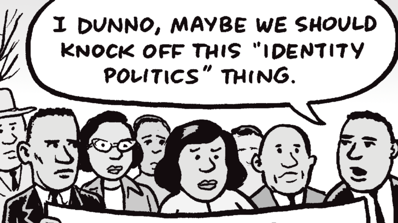
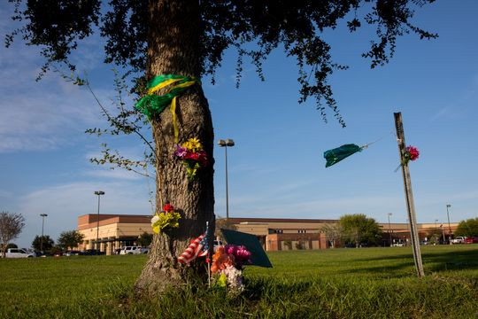

Na manhã do dia 27 de Outubro de 2018, Robert Bowers, morador de Pittsburgh, USA, tomou uma decisão: após desabafar nas redes sociais, invadiu uma sinagoga e abriu fogo contras os judeus lá presentes. No total, 11 pessoas foram mortas.

Bowers será indiciado por “crime de ódio” e, caso condenado, deverá enfrentar a pena de morte.

O atentado é tido como o ataque mais mortal aos judeus na história dos Estados Unidos de acordo com a [Anti-Defamation League](https://www.adl.org/).

A imprensa logo correu para acusar Bowers de alt-right. De fato, supremacistas brancos têm histórico anti-semita e a associação é natural. No entanto, popularizou-se nos Estados Unidos recentemente a ideia de que tais extremistas são associados ao presidente Trump. Não é o caso de Bowers. Na mesma rede social onde declarou estar indo ao ataque, ele destilou críticas a Trump e afirmou que o atual presidente não recebeu o seu voto.

> “I can’t sit by and watch my people get slaughtered. Screw your optics, I’m going in.” — Bowers na rede social Gab

O ocorrido é lamentável e pode ter pego muita gente de surpresa, mas o fato é que os casos anti-semitas tem aumentado nos Estados Unidos. De forma até surpreendente, o New York Times publicou essa semana uma matéria com um título reflexivo: [é seguro ser judeu em Nova Iorque?](https://www.nytimes.com/2018/10/31/nyregion/jewish-bias-safety-nyc.html)

Ao contrário do que popularmente acreditado, **metade dos crimes de ódio em Nova Iorque tem judeus como alvos**. Comparativamente, são **4x mais do que contra negros e 20x mais do que contra transgêneros**.

Os números são impressionantes, não porque outros grupos são menos importantes — crimes de ódio são abomináveis e deve ser punidos como tal. No entanto, a cultura popular e a cobertura da mídia tem sido absolutamente desproporcional — e não em favor da comunidade judaica.

Se os números são tão desproporcionais, por que eles não fazem parte do noticiário?

A resposta para essa pergunta é o título desse texto: **pois os fatos não se encaixam na agenda.**

<blockquote class="twitter-tweet" data-lang="en">
I’m actually shocked that the NY Times ran the piece. It’s (probably unintentionally) the best destruction of Intersectionality and Identity Politics that has ever appeared in the paper. <a href="https://t.co/tKGYSCsGAN">https://t.co/tKGYSCsGAN</a>
&mdash; Dave Rubin (@RubinReport) <a href="https://twitter.com/RubinReport/status/1058095862163881984?ref_src=twsrc%5Etfw">November 1, 2018</a></blockquote>

Dave Rubin, assim como muitos, se surpreenderam com a exposição clara da hipocrisia da esquerda neste caso em particular. Segundo o NYT:

> During the past 22 months, not one person caught or identified as the aggressor in an anti-Semitic hate crime has been associated with a far right-wing group, Mark Molinari, commanding officer of the police department’s [Hate Crimes Task Force](https://www.ny.gov/programs/hate-crimes-task-force), told me.

E em outra passagem:

> In fact, it is the varied backgrounds of people who commit hate crimes in the city that make combating and talking about anti-Semitism in New York much harder (…)

O que nos faz concluir (e o que me deu a inspiração para esse texto):

> That anti-Semitism would go unchallenged (and the fight against it unchampioned) just because it didn't fit a particular narrative, is disgusting.
> — [Brad Thor](https://twitter.com/BradThor/)

Anti-Semitismo não se encaixa na narrativa da esquerda. Não existe um grupo opressor bem definido na outra ponta. Os agressores, podem apoiar Trump ou odiá-lo — como Robert Bowers demonstrou. Não é fácil apontar dedos. Não existe um grupo específico a se atacar. Resultado? Melhor fingir que não ocorre.

Em outros atentados famosos, como na [boate Pulse em 2016](https://en.wikipedia.org/wiki/Pulse_nightclub) e [numa escola do Texas](https://www.nytimes.com/2018/05/18/us/school-shooting-santa-fe-texas.html) no início desse ano, o call to action foi muito maior. Novamente, *não é meu objetivo relativizar tragédias nem desmerecer a dor e o sofrimento das vítimas e seus familiares afetados*. Mas sim, entender que quando uma determinada agenda política está envolvida, o melhor a se fazer é analisar a situação friamente.

Na tragédia da boate Pulse, além do resultado lamentavelmente maior (foram 49 mortos no total), o fato de ser um *gay nightclub* expôs a intolerância ao mundo inteiro. Já em Santa Fé, onde um adolescente de 17 anos abriu fogo em sua escola e deixou 10 mortos, a retórica contra o desarmamento populou os noticiários por meses (convenientemente ignorando que possuir uma arma nessa idade e carregá-la até uma escola são infrações legais).

Porém, na tragédia de Pittsburgh, não há ganho político claro em debatê-lo. A direita sai enfraquecida? Certamente não da mesma forma como seria se o massacre tivesse sido direcionado a transsexuais.

Se não há ganho claro, só nos resta lamentar pela comunidade judaica, os reais perdedores do episódio. E entender que *identity politics*, um jogo bastante jogado no mundo ocidental atual, não se interessa pela realidade quando os fatos não se encaixam na agenda.