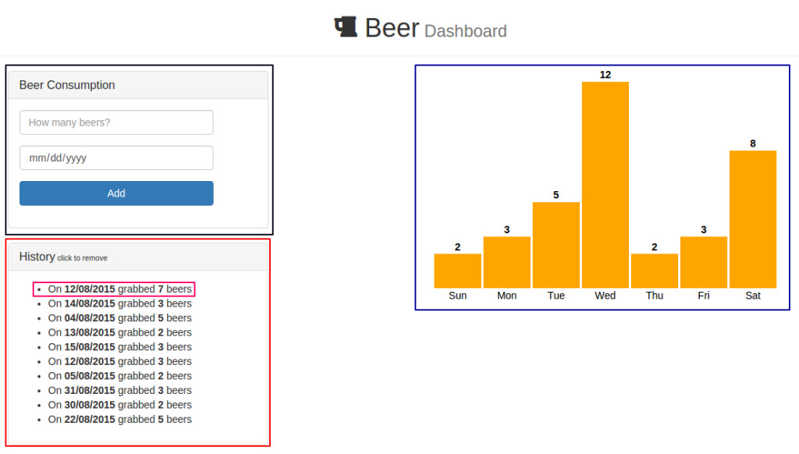

Meteor has recently [announced official support for React](https://blog.meteor.com/meteor-the-missing-infrastructure-for-building-great-react-apps-b770ef788fd6) as its rendering engine (together with Blaze). This is great news, once React is becoming more and more popular and brings improvements in many aspects of your code (reusability, unit-testing, no spaghetti code…).

Since the React fever, many tutorials explain how to integrate it with the most popular libraries outside. The perspective of a reactive chart using React components and [D3.js](https://d3js.org/) is pretty exciting and in fact there are many guides out there exploring this subject. [This one correlates D3 and React lifecycles](http://nicolashery.com/integrating-d3js-visualizations-in-a-react-app/) and [this other explores svg components](http://busypeoples.github.io/post/d3-with-react-js/).

The aim of this tutorial is to take a step further and show how to build reactive charts with React and D3, but using the Meteor ecosystem.

If you are not familiar at all with [React](https://reactjs.org/) and [D3](https://d3js.org/) I suggest you to take a break and read about them before continuing.

In order to make things nicer, we will develop a full-functional web application that will keep track of how many beers you drink on each day of the week. More than detecting if you are an alcoholic, the aim of this app is to show how we can take advantage of React power to build reactive components that comprises D3 elements and receive data from Meteor.

You might want to follow the code in [github](https://github.com/rafaelquintanilha/meteor-react-d3). Time to start!

## Designing the App

As React is component-based this step is important and may save you a lot of time in the future. The plan is to have two columns:

- The leftmost will have a form to insert data and a list of all data previously inserted when one will be able to remove it by clicking.
- The rightmost will render a bar chart.

Let’s breakdown our app into components:



The `App` component encompasses all components and will be responsible for gathering data from the MongoDB and passing it accordingly.

The black rectangle is the `BeerForm` component. It’s a basic form where we will add the number of beers and the day that event happened.

The red rectangle is the `BeerList` component, which encapsulates the data and renders a BeerItem component (in pink), formatting the data nicely and allowing us to click in any record to delete it.

Finally, the blue rectangle is our star – the `BarChart` component. It will receive data from Meteor and render this nice bar chart. This component was designed to be reusable, so the only thing you will need to do is to pass the correspondent data and it will be able to render the chart (with an horizontal label and a top label informing quantity).

Now time to dig into some code!

## Setting up the environment

This is the default step. In your console, type:

```
$ meteor create beer-dashboard
$ cd beer-dashboard
```

You will note that three files were automatically generated. Get rid of them. Time for adding packages:

```
$ meteor add react
$ meteor add d3js:d3
$ meteor add momentjs:moment
$ meteor add twbs:bootstrap
$ meteor add fortawesome:fontawesome
```

The first is the official react package bundled by the Meteor Development Group. The second is [the official D3.js package for Meteor](https://atmospherejs.com/d3js/d3). We are doing some date manipulation, so [MomentJS](http://momentjs.com/) is a good choice. Fourth and fifth are Bootstrap and FontAwesome, just for styling purposes.

## Defining the Collection

Let’s begin defining the only server-side piece of our app (although it is also client-side in order to achieve [latency compensation](https://blog.meteor.com/optimistic-ui-with-meteor-67b5a78c3fcf)). In the top-level directory of your app, create a **collections.js** file and add the following:

```js
Beers = new Meteor.Collection("Beers");

Meteor.methods({
	"insertBeer": function(numBeers, date) {
		numBeers = parseInt(numBeers);		

		check(numBeers, Number);
		check(date, Date);

		return Beers.insert({beers: numBeers, date: date});
	},

	"removeBeer": function(id) {		
		check(id, String);		
		return Beers.remove(id);
	}
})
```

We are defining our collection (Beers) and two methods which will be called in our components. Here, `insertBeers` takes the number of beers and the date, checks for inconsistencies and saves into the DB. On the other hand, `removeBeer` takes an id and removes the entry.

## BeerForm Component

This is the top panel of the left-side column and should be straightforward. Create a *client/* folder and **beerform.jsx** inside it. Then add the code:

```js
BeerForm = React.createClass({
	handleSubmit: function(e) {
		e.preventDefault();
		var numBeers = React.findDOMNode(this.refs.numBeers);
		var beerDate = React.findDOMNode(this.refs.beerDate);
		
		Meteor.call("insertBeer", numBeers.value, moment(beerDate.value).toDate(), function(e, r) {
			if (e) alert(e.reason)			
		});

		numBeers.value = "";
		beerDate.value = "";
	},

	render: function() {		
		return (
			<div className="panel panel-default">
			  <div className="panel-heading">
			    <h3 className="panel-title">Beer Consumption</h3>
			  </div>
			  <div className="panel-body">
			    <form className="form-horizontal" onSubmit={this.handleSubmit}>
				  <div className="form-group">				    
				    <div className="col-sm-10">
				      <input type="number" className="form-control" 
				      		placeholder="How many beers?" ref="numBeers" />
				    </div>
				  </div>
				  <div className="form-group">				    
				    <div className="col-sm-10">
				      <input type="date" className="form-control" ref="beerDate"/>
				    </div>
				  </div>
				  
				  <div className="form-group">
				    <div className="col-sm-10">
				      <button type="submit" className="btn btn-primary btn-block">Add</button>
				    </div>
				  </div>
				</form>
			  </div>
			</div>
		);
	}
})
```

If you are familiar with React, there’s no news in there. For those that are not so much, let me explain a little bit.

`React.createClass()` is where you create your components. The only mandatory function every component must have is the render function, the place you will actually render something into the DOM.

From line 17-42 is just Bootstrap markup. Two important points:

When writing JSX files (which React will take care of translating to pure JavaScript for you) you write className instead of class.
Line 22 handles the submit calling the `handleSubmit()` function defined previously.
From line 2-13, our custom function `handleSubmit()` will take care of any event it was attached (in this case, `onSubmit` as you can guess). Notes on this code:

Line 3 we prevent the form to be actually sent.
Lines 4-5 get the DOM nodes of the fields through the ref attribute, passing in Lines 7-9 their correspondent value to the Meteor method we defined before. Note this call is asynchronous.
Lines 11-12 we just clean the form up.
Great! Our first component is done and we are able to insert data into our collection. Go to your browser console and type `Beers.find().fetch()` to see if it’s working. The only missing point is we haven’t defined where `BeerForm` will be rendered.

## Meteor-powered React

It’s time for starting sketching our `App` component – which will render all components together. But before that we need to render the component, so create the files **client/index.html** and **client/init.jsx** and put the following:

```html
<head>
  <title>React + d3 + Meteor</title>  
</head>

<body></body>
```

```jsx
Meteor.startup(function() {
	React.render(<App />,  document.body);	
});
```

Here we are instructing React to render the `App` component into `document.body` when client starts.

Now create **client/app.jsx**:

```jsx
App = React.createClass({
	mixins: [ReactMeteorData],

	getMeteorData() {
	    return {
	      beers: Beers.find({}).fetch()
	    }
  	},

	render: function() {		
		return (
		  <div>
		  	<div className="page-header">
					<center>
						<h1>
						<i className="fa fa-beer"></i> Beer 
						<small> Dashboard</small></h1>
					</center>
			</div>

			<div className="container">
				<div className="row">
					<div className="col-md-4">
						<BeerForm />		
					</div>

					<div className="col-md-offset-2 col-md-6">					
					</div>
				</div>
			</div>        
		  </div>
		);
	}
});
```

Try to run your code now to see if everything is working. It should display the `BeerForm` component and the header. The only tricky thing here is Line 2-8. There is where Meteor shines and really empowers React.

While in Line 2 you tell React you are going to fetch data from your Meteor database, the function `getMeteorData()` says you are storing the object beers in `this.data`. Better still, it’s reactive! You now can pass it via props to children components, so you can add that to your code:

```jsx
...
<div className="row">
  <div className="col-md-4">
    <BeerForm />
    <BeerList data={this.data.beers}/>
  </div>
  ...
```

The `BeerList` component is receiving whatever you have in `this.data.beers`, which in our case is the recently-fetched data from the `Beers` collection. Everything nice, let’s move forward.

## BeerList and BeerItem Components

In **client/beerlist.jsx**:

```jsx
BeerList = React.createClass({	

  	renderBeers() {		
		return this.props.data.map((beer) => {			
		  return <BeerItem beer={beer} />;
		});
	},

	render: function() {		
		return (
			<div className="panel panel-default">			  
			  <div className="panel-heading">
			    <h3 className="panel-title">History
			    <small> click to remove</small>
			    </h3>			    
			  </div>
			  <div className="panel-body">
			    <ul>
			    	{this.renderBeers()}
			    </ul>
			  </div>
			</div>
		);
	}
})
```

Because it makes sense to handle the logic in every individual component, we define `BeerItem`, which receives the beer object. Note the data fetched from Meteor is now accessible in `this.props.data`.

Let’s end this part creating **client/beeritem.jsx**:

```jsx
BeerItem = React.createClass({
  	handleClick() {
  		var id = this.props.beer._id;
  		Meteor.call("removeBeer", id, function(e) {
  			if (e) alert(e.reason);
  		});
  	},

	render: function() {
		var date = moment(this.props.beer.date).format("DD/MM/YYYY");	
		var tail = this.props.beer.beers > 1 ? "beers" : "beer";

		return (
			<li onClick={this.handleClick}>On <strong>{date}</strong> grabbed <strong>{this.props.beer.beers}</strong> {tail}</li>
		);
	}
})
```

Comments:

- Be careful: data now is in `this.props.beer` in spite of what happened on the parent component.
- We do some formatting to display things nicer.
- Remember the `removeBeer` method we created at first? Here is when it’s invoked.

See your work now on the browser. Our left column is done and you are able to insert elements through the form and delete any record simply by clicking on each item in the bottom panel.

## Mapping Data

Before coding the `BarChart` component, it’s worthy to spare a couple minutes to think about its functionality and how we could reuse it in a future project. That’s what I thought for this case:

- It must have a label indicating the quantity of each bar.
- It must have a label grouping each bar in some concept (e.g.: weekday, month, country, brand…).
- It must have flexible width and height.

You can think in many more functionalities (bar colors and transition effects for example) but we are sticking to the aforementioned.

Our goal is to receive the data in a specific format and then render the chart “agnostically”. This will allow you to reuse this component in any other module, or even a project that is not Meteor-based! All you need is to ensure the data is passed in the correct format.

That being said, let’s define the data parameter will be an array of objects, each object comprising two parameters: `qty` and `xLabel`. Our component will iterate over every object and draw a bar associated with it, labeling it horizontally with the `xLabel` value and defining its height based on the `qty` value.

More specifically, go back to **app.jsx** and add the function:

```jsx
...
getMeteorData() {
  return {
      beers: Beers.find({}).fetch()
    }
  },

  mapData: function() {  		
    var data = [
      { qty: 0, xLabel: "Sun" }, 
      { qty: 0, xLabel: "Mon" },
      { qty: 0, xLabel: "Tue" },
      { qty: 0, xLabel: "Wed" },
      { qty: 0, xLabel: "Thu" },
      { qty: 0, xLabel: "Fri" },
      { qty: 0, xLabel: "Sat" },
    ];
    this.data.beers.map(function(d) {
      data[moment(d.date).weekday()].qty += d.beers;
    });
    
    return data;
  },
...
```

Check the `mapData` function. It initializes the array of objects with no quantities but previously defined labels. Next we map the beers object (returned from our collection) with the aid of MomentJS to add the number of beers to the `qty` property. The code might seem weird but it’s just JavaScript.

Our last change in this file is to render the `BarChart` component with mapped data. So go the `render` function and add in the second column:

```jsx
...
<div className="container">
  <div className="row">
    <div className="col-md-4">
      <BeerForm />
      <BeerList data={this.data.beers}/>
    </div>

    <div className="col-md-offset-2 col-md-6">					
      <BarChart data={this.mapData()} width="480" height="320"/>
    </div>
  </div>
</div> 
...
```

Differently from the `BeerList` component, here the data object is coming through `mapData` function.

Everything set, let’s bring D3 to the show.

## BarChart Component

Let’s code the state-of-art of reactive chart rendering. Create **client/barchart.jsx** and add:

```jsx
BarChart = React.createClass({

	componentDidMount: function() {		
  		var el = this.getDOMNode(); // This is de div we are rendering
  		var svg = d3.select(el)
  				.append("svg")
  				.attr("width", this.props.width)
  				.attr("height", this.props.height);
  		  		
  		this.updateChart(this.props);
  	},

  	componentWillUpdate: function(nextProps) {  		
  		this.updateChart(nextProps);
  	},

	getDefaultProps: function() {
		return {
		  width: 640,
		  height: 480
		}
	},

    render: function() {
        return (
        	<div className="chart"></div>            
        );
    }
});
```

Let’s start easy. React has well-defined [components lifecycle](https://reactjs.org/docs/react-component.html), some of them we will use now. Starting from the bottom:

- `render` returns an empty div. In a while we will render our svg into it.
- `getDefaultProps` is a protection for the case not all props are passed. In this case, we are setting the default values for width and height.
- `componentWillUpdate` is invoked every time the props change. Means that as our data is reactive, any change will trigger the custom `updateChart(props)` function (which we will define soon). Note the function takes a `nextProps` parameter, which is exactly what we need – whenever the props change, pass the new props to the rendering function.
- `componentDidMount` is invoked once when the component is first rendered. Here we create our svg tag inside the div the component is rendering (returned by the `this.getDOMNode` function) with the sizing properties we established. After that, we call the rendering function to draw the bars in case there are any data.

It’s worthy to note that our `App` component might take a while to fetch all information, so the component might be initialized without any data. The guard for this is to update accordingly in response to the `componentWillUpdate` callback.

Canvas set, but we are not rendering anything! Let’s fix that adding the following:

```jsx
updateChart: function(props) {
    var data = props.data;

    var max = _.max(_.pluck(data, "qty"));
    var yScale = d3.scale.linear()
      .domain([0, max])
      .range([0, props.height - 35]);

    var xScale = d3.scale.ordinal()
      .domain(d3.range(data.length))
      .rangeRoundBands([0, props.width], 0.05);

    var svg = d3.select("svg");

    var bars = svg.selectAll("rect").data(data);
    bars.enter()
        .append("rect")
        .attr("fill", "orange")	        

    bars.transition()
      .duration(1000)
      .attr("x", function(d, i) {	    		
          return xScale(i);
        })
        .attr("y", function(d, i) {
          return props.height - yScale(d.qty) - 20;
        })
        .attr("width", xScale.rangeBand())
        .attr("height", function(d, i) {
          return yScale(d.qty)
        });

    bars.exit()
        .remove();

    var qtyLabel = svg.selectAll(".qtyLabel").data(data);
    qtyLabel.enter()
        .append("text")
        .attr("class", "qtyLabel")
        .style("font-weight", "bold")
        .attr("text-anchor", "middle")

    qtyLabel.transition()
      .duration(1000)									
    .attr("x", function(d, i) {
      return xScale(i) + xScale.rangeBand()/2;
    })
    .attr("y", function(d, i) {
      return props.height - yScale(d.qty) - 25
    })
    .text(function(d, i) { 	    	  	
      return d.qty; 
    });

    var xLabel = svg.selectAll(".xLabel").data(data);
    xLabel.enter()
        .append("text")
        .attr("class", "xLabel")

    xLabel.text(function(d, i) { 	    	  	
          return d.xLabel; 
        })
        .attr("text-anchor", "middle")
        .attr("x", function(d, i) {
          return xScale(i) + xScale.rangeBand()/2;
        })
        .attr("y", function(d, i) {
          return props.height - 5; 
        });
},
```

If you are familiarized with D3, there’s nothing to worry about it. For those who aren’t, some explanation:

- Line 4 uses [Underscore](http://underscorejs.org/) to get the maximum value of `qty`. We use it to define our vertical scale. Note we give some space on the top to add the label.
- Lines 15-18 we bind all rect elements to the data we mapped before and handle when a new rect is detected (appending into svg and setting its color).
- Lines 20-31 is where we perform updates. Transitions smooth the changes and we set the new values of x, y, width and height. Note we also give some space now at the bottom to insert another label.
- Lines 33-34 deletes unnecessary rects.
- Lines 36-70 describe pretty much the same, now with labels and some positioning adjustment. This is nothing but a trial-and-error game until you feel comfortable.

And we are done! More important than the code is how to behave when integrating React and D3 – you first render the svg and then updates the elements (rect and text in this case) whenever your data changes.

## Summarizing

This was a very comprehensive and long tutorial. Take a time to digest everything but keep the notion that integrating Meteor, React and D3 shouldn’t be painful. Moreover, if you are careful when designing your components, they will be reusable from now on.

Exercise: how could you improve `BeerForm`, `BeerList` and `BeerItem` to become a single solid and reusable component?

In the likely event that something could have be implemented better or more efficiently, don’t hesitate and make a comment or start a new discussion. See you around!