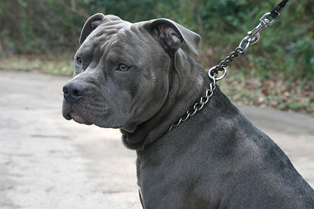

O roteiro é bizarro. Os personagens, inesperados. O desfecho, previsível. Assim encerra-se a polêmica que agitou os bastidores políticos do Brasil nos últimos 10 dias (como se não houvesse mais o que se discutir).

Tudo começou como deveria começar, ainda que quase nunca assim o seja. Jornalismo investigativo, em extinção, desvendou um suposto esquema de candidatos laranjas do PSL, partido do presidente da República. Assim acontecia: candidatos sem pretensão de se elegerem solicitavam acesso ao fundo partidário (uma atrocidade tupiniquim) e repassavam o dinheiro na forma de caixa 2. A Folha, em rara lucidez jornalística, soou o alarme.

O ex-ministro da Secretaria-Geral e então presidente do partido, Gustavo Bebianno, lavou as mãos. Em entrevista ao O Globo, afirmou não ser de sua responsabilidade a decisão sobre quem recebe cada repasse e se autobenzeu: minimizou o caso justificando ter até conversado com o presidente, à época internado no Albert Einstein, por três vezes.

E então, *out of the blue*, o desastre aconteceu. Inconformado com a frase aparentemente inofensiva do ex-ministro, Carlos Bolsonaro, o pitbull, tirou a focinheira. Chamou-o de mentiroso e [divulgou um áudio](https://g1.globo.com/politica/noticia/2019/02/13/filho-de-bolsonaro-divulga-audio-do-pai-para-dizer-que-ministro-bebianno-mentiu.ghtml) onde seu pai desconversava com Bibianno sob justificativa de ainda convalescer de sua cirurgia.

Carlos, que nunca teve filtro, agiu com o fígado, como sempre age.

Bebianno, político experiente, agiu como um namorado injustiçado e cometeu um erro absolutamente **injustificável**: para provar sua "razão", [vazou áudios com o presidente para a imprensa](https://www.oantagonista.com/brasil/os-audios-de-bebianno-para-bolsonaro/).

Se o problema era intepretativo, semântico ou apenas imaturidade de Carlos, pouco importa. O ministro conseguiu quebrar a confiança do relacionamento com o presidente e como consequência teve que sair pela porta dos fundos. Sabendo que os filhos, como já avisara Eduardo Bolsonaro, são indemissíveis, que outro resultado seria aceitável?

A boa notícia nesse show de horrores presidencial foi o fato dos áudios terem sido bastante positivos ao presidente. Claro, seus opositores subitamente se uniram a Bebianno (o qual há pouco ninguém sabia quem era) e entoaram o coro de "Bolsonaro mentiroso". Mas nos áudios divulgados, que em tese corroboram a versão de "sim senhores eu falei com o presidente trêz vezes" (embora em nada tenham a ver com o laranjal), o que se viu foi o presidente preocupado em cumprir sua palavra com a população, pulso firme e papo reto.

Para quem se acostumou a Joesleys, [Bessias, "grelos-duros" e Maricá](http://g1.globo.com/pr/parana/noticia/2016/03/pf-libera-documento-que-mostra-ligacao-entre-lula-e-dilma.html), foi sem dúvida uma vitória.

Bebianno demonstrou despreparo. Caiu cedo demais, mas no tempo certo. Carlos demonstrou imaturidade. Ganhou a batalha, mas assim como seu irmão Flávio, precisará manter um *low profile*. Bolsonaro demonstrou seriedade. Perdeu um ministro que provou-se desleal e colocou uma coleira no pitbull.

No final dessa história desnecessário, só Jair se salva.