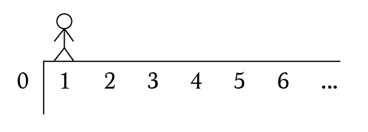

I was scrolling through my Twitter feed in a boring Saturday afternoon when I stumbled upon this tweet:

<blockquote class="twitter-tweet"><p lang="en" dir="ltr">Dear <a href="https://twitter.com/nntaleb?ref_src=twsrc%5Etfw">@nntaleb</a> , will you post this puzzle in memory of <a href="https://twitter.com/CutTheKnotMath?ref_src=twsrc%5Etfw">@CutTheKnotMath</a>? I had it in an exam 21 years ago and still do not know the solution. I am sure your followers or you will do it and I will learn something useful. Thank you! <a href="https://t.co/e9HXQZwo9K">pic.twitter.com/e9HXQZwo9K</a></p>&mdash; Adrian Mureșan (@bilayerguy) <a href="https://twitter.com/bilayerguy/status/1098926919402311680?ref_src=twsrc%5Etfw">February 22, 2019</a></blockquote> <script async src="https://platform.twitter.com/widgets.js" charset="utf-8"></script>

I was immediately thrilled - finally something interesting to do!

Here's the problem in full:

> A drunken sailor stands near the edge of an abyss and takes random steps either towards or away from the edge. A step towards the edge has a probability of $p$ and a step away from the edge has a probability of $(1 - p)$. If the sailor starts $n$ steps from the edge, what is his chance of survival? What is the minimum value of $p$ for which there is no chance of survival?

Turns out the solution for this problem is not beautiful only mathematically, but also provides great insights for our daily life.

Let's solve it first.

## Solving Computationally

Before jumping into the maths, let's try to get some intuition from code. Here's a simple simulator for our problem:

<iframe src="/apps/drunken-sailor/" width="100%" height="380px" scrolling="no" frameborder="0"></iframe>

The complete code is on [GitHub](https://github.com/rafaelquintanilha/blog/blob/master/src/apps/drunken-sailor/) but the algorithm is pretty straightforward.

```jsx
const MAX_ITERATIONS = 10000;

const updatePosition = (currentPosition, p) => {
  const randomVariable = Math.random();
  if ( randomVariable < p ) return currentPosition - 1;
  else return currentPosition + 1;
}

const simulation = (initialPosition, p) => {
  let iterations = 0;
  let currentPosition = initialPosition;
  while ( currentPosition > 0 && iterations <= MAX_ITERATIONS ) {
    currentPosition = updatePosition(currentPosition, p);
    iterations++;
  }
  return [currentPosition, iterations];
}
```

The trick is to think in the sailor's position as a point in the x axis. We update the position until he dies (`currentPosition === 0`) or the maximum number of iterations is reached. In every round we compare a random variable between 0 and 1 (yielded by `Math.random`) with $$p$$ and move the sailor left or right accordingly.

I encourage you to play a little bit with the simulator and check how's your intuition going. In any case, here's a table with the % of deaths for some combinations of $n$ and $p$:

$p$ | Deaths ($n = 5$) (%) | Deaths ($n = 15$) (%) | Deaths ($n = 50$) (%) 
--- | --- | --- | ---
0.1 | 0    | 0    | 0
0.2 | 0    | 0    | 0
0.3 | 1.7  | 0    | 0
0.4 | 13.2 | 0.3  | 0
0.5 | 96.1 | 86.8 | 61.8
0.6 | 100  | 100  | 100
0.7 | 100  | 100  | 100
0.8 | 100  | 100  | 100
0.9 | 100  | 100  | 100

As one could imagine, the % of deaths increases with $p$ and somehow decreases with $n$... but only for values around $0.5$. It seems that the fate of our beloved sailor is settled for $p > 0.5$ and therefore this should be the answer to the second question of the problem.

Let us now find the exact probability of survival.

## Solving Mathematically

There are many solutions for this problem but the one I liked most was written in [this post by Brett Berry](https://medium.com/i-math/the-drunkards-walk-explained-48a0205d304). Here's a summary:

Recall that in order to solve through code we abstracted the sailor's position into a point in the x axis. Let $P(n)$ be the probability that the sailor dies when $n$ steps away from the edge.

<figure>
  
  <figcaption>Representation of the sailor in the x axis. <a href="https://medium.com/i-math/the-drunkards-walk-explained-48a0205d304">Credit: Math Hacks</a>.</figcaption>
</figure>

Then:

$$$
P(1) = p + (1 - p) P(2)
$$$

The sailor surely dies if he goes to the left (with probability $p$). But if he manages to move right, we now have him in $n = 2$ and therefore the probability that he dies is what we call $P(2)$.

Well, in order to die he **necessarily** needs to move to the left (i.e. go from $n = 2$ to $n = 1$). But what is $P(1)$ if not the probability that the sailor moves one unit left? Therefore, $P(2) = P(1)$ *times the probability of going from $n = 1$ to $n = 0$, or, $P(1)$*.

Hence:

$$$
P(1) = p + (1 - p) P(1)^2
$$$
$$$
(1 - p) P(1)^2 - P(1) + p = 0
$$$

Which yields $P(1) = 1$ or $P(1) = \frac{p}{1 - p}$.
Now, notice that $P(1)$ is a probability and therefore must be in the $[0, 1]$ range. Follows that $\frac{p}{1 - p} \leq 1$ and then $p \leq \frac{1}{2}$.

Finally, we can write:

$$
P(1) = \begin{cases}
   1 &\text{if } p \gt \frac{1}{2} \\
   \frac{p}{1 - p} &\text{if } p \leq \frac{1}{2}
\end{cases}
$$

Once $P(2) = P(1)^2$, it follows that:

$$
P(2) = \begin{cases}
   1^2 &\text{if } p \gt \frac{1}{2} \\
   (\frac{p}{1 - p})^2 &\text{if } p \leq \frac{1}{2}
\end{cases}
$$

By the same reasoning presented above, $P(3) = P(1)^3$. It follows that, for a given $n$:

$$
P(n) = \begin{cases}
   1 &\text{if } p \gt \frac{1}{2} \\
   (\frac{p}{1 - p})^n &\text{if } p \leq \frac{1}{2}
\end{cases}
$$

Which completes our answer and matches the results found in the simulations.

## Intepreting the Result

The answer for this problem is quite interesting because it reveals a big assimetry: for any value $p > \frac{1}{2}$, the sailor will eventually die. Certainly, for any number sufficiently big of iterations (we are using a relatively small number of 10000 iterations per simulation), the sailor dies anyway. *But real life often has an upper limit* and therefore I'm not interested in $n \to \infty$.

But once life is finite and the sailor can't take random steps forever, how resilient he is? In other words, **what's the probability of survival given that the sailor has been surviving for a while?**

## The Lindy Effect

The Lindy Effect is a theory for our very intuition. From [Wikipedia](https://en.wikipedia.org/wiki/Lindy_effect):

> The Lindy effect is a theory that the future life expectancy of some non-perishable things like a technology or an idea is proportional to their current age, so that every additional period of survival implies a longer remaining life expectancy.

In simple words, the longer *something* lives, the longer it is expected to live. We are used to perceive this as the "test of time". If you give enough time for an idea to be tested and it survives (i.e. people keep adopting it), chances are it will survive for a while.

How does this applies to the Drunken Sailor problem?

Let us try to observe the outcome of his random walk after an arbitrary number of rounds (iterations). For example, given that the sailor survived 100 rounds, how many times does he end up alive? And for 1000? 5000?

Consider the following table for $p = 0.5$, $n = 10$ and $10,000$ simulations, where $i$ is the min number of iterations for a surviving sailor:

$i$ | Survived at this point | Died in the end | Survival rate (%) 
--- | --- | --- | ---
10 | 10,000    | 9,230    | 7.70
100 | 6,793    | 6,023    | 11.34
1000 | 2,527  | 1,757    | 30.47
5000 | 1,129 | 359  | 68.20

The table is very informative -- if a sailor manages to survive until the 1000th iteration (which is only $\frac{1}{10}$ of the number of rounds), *he increases his chance of survival by a factor of 4*. If he survives until half of the iterations, *his survival rate increases 800%!*

The sailor is, therefore, Lindy. The longer he lives, the longer he is expected to live.

## Conservatism

The Drunken Sailor Problem and the Lindy Effect help us understand what conservatism is about. Sometimes, we want to be *progressives*, in a way that we expect changes to happen too fast. On the other hand, *conservatives* await for the *test of time*, for technologies and ideas that are *Lindy* and for sailors that are alive even though they've been drunk for a while.

Lindy enhances *evolution*. What survives tend to have offsprings that are alike. Things that change very quickly don't allow evolution do its job.

**That doesn't mean that we should wait forever** -- recall that even dying $\frac{1}{3}$ less when they hit the 5,000 mark compared to when they start to walk, *31% of the sailors still die*. But we should be respectful of things that have survived for a considerable amount of time.

You might not like it -- but you should at least pay attention to the Bible, Charles Dickens' tales, Sherlock Holmes' novels, organic food and The United States Constitution.

For what is new might be fragile for events that are hard to anticipate. And drunken sailors might avoid falling off a cliff.